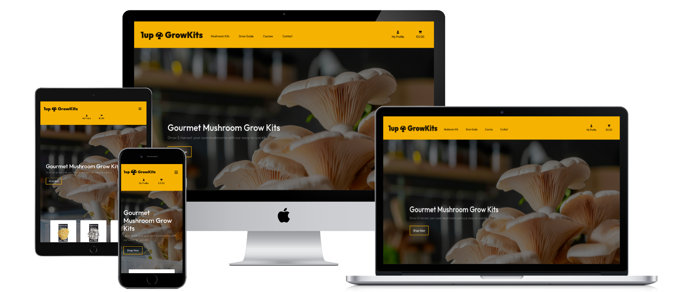
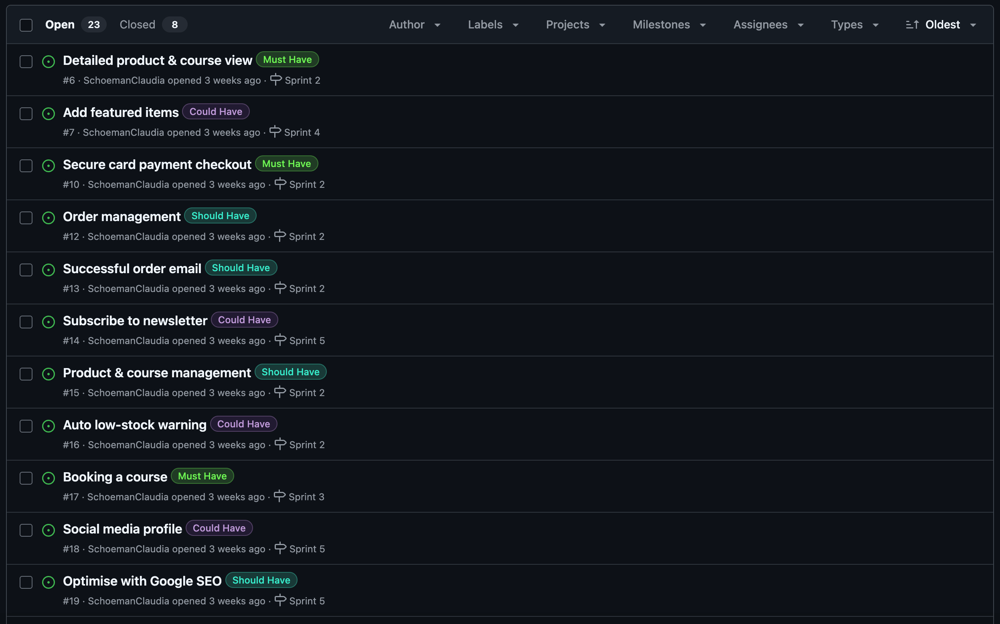
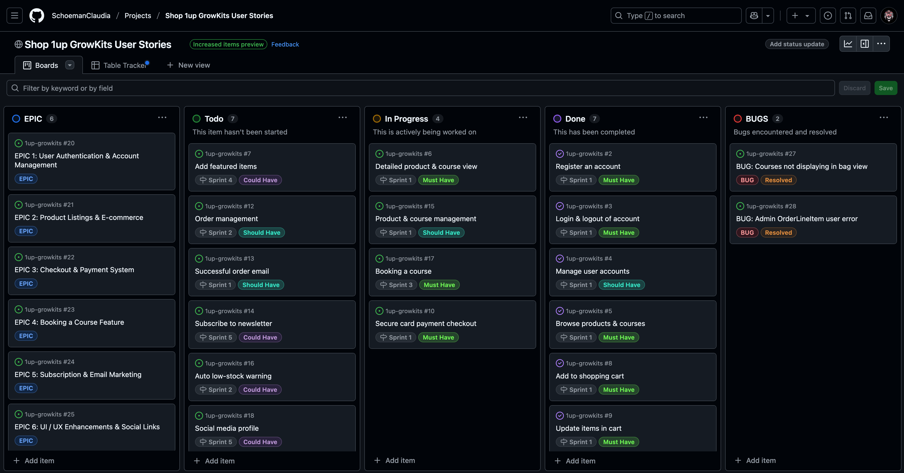
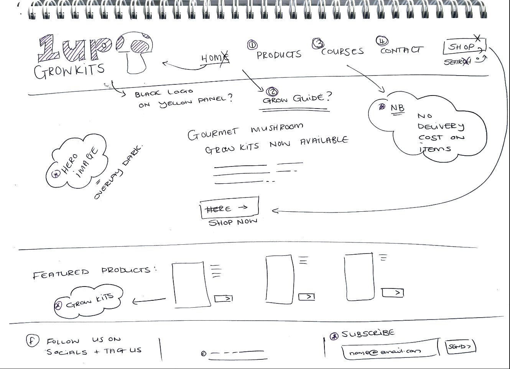
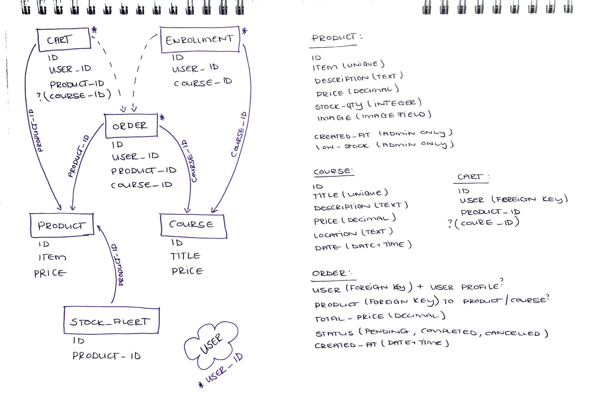

# 1up GrowKits

It's more than just an e-commerce store, it's a gateway to sustainable living, self-sufficiency, and hands-on learning.

We are on a mission to empower people, from hobbyists to urban farmers, by providing premium mushroom grow kits and expert-led courses that bring the magic of mushroom cultivation to homes and businesses.

In a world where people crave organic, homegrown food, our platform offers a seamless, educational, and rewarding experience. Customers can purchase high-quality grow kits, book hands-on courses, and access expert knowledge, all through an intuitive and beautifully designed online store.

1up GrowKits is not just a store, it’s a community-driven movement toward sustainability, self-reliance, and the joy of growing your own food.

Let’s grow together!


Live Link: 




## Overview

1up GrowKits is an e-commerce platform for purchasing mushroom grow kits and educational courses on mushroom cultivation. The website offers a seamless shopping experience, with secure Stripe payments, AWS-backed media hosting, and a scalable e-commerce system. Customers can also subscribe to the Mailchimp newsletter for updates and promotions.

- [x] A modern and user-friendly e-commerce store.
- [x] A dedicated course booking system for scheduled training.
- [x] Secure payment processing via Stripe.
- [x] Admin product management with CRUD functionality.
- [x] AWS S3 for media storage (product images).
- [x] Newsletter subscription integration with Mailchimp.
- [x] Facebook social links in the header and footer.


## Web Marketing Strategy

- **Content Marketing**: Blogs, YouTube tutorials, social media reels
- **Emailers**: Launch announcements, course welcome series, recipes
- **Social Media Campaigns**: Product demos, giveaways
- **Referral & Loyalty Programs**: Encourage word of mouth, referal rewards
- **Influencer Collaborations**: Wellness, gardening, sustainability niches


__Products & Services__

- **Mushroom Grow Kits**
  - Ready-to-grow kits (Oyster variations & Lion’s Mane)
  - Designed for beginners — no prior experience needed

- **Growing Courses**
  - Beginner to advanced mushroom cultivation
  - Hands on lessons and grow guide tips

- **Community Support**
  - Access to grower supports on social platforms


__Target Market__

**Primary Audiences:**
- Hobbyists & DIY enthusiasts
- Health & wellness seekers
- Beginner growers
- Parents & educators
- Aspiring micro-farmers / entrepreneurs

**Demographics:**
- Age 20 to 45
- Urban / suburban living
- Sustainability on the mind
- Active on social media

**Market Problem**
Most mushroom grow products and courses on the market are:
- Too complex or scientific for beginners
- Lack customer support / community
- Not visually appealing or well-branded

**Our Solution:**
- Aesthetically packaged, foolproof grow kits
- Easy-to-follow, high-quality instructional content
- Friendly support & growing community
- Optional kit & course bundles for seamless learning


__Audience Sales Model__

**Primary Sales:**
- Direct-to-consumer sales (grow kits & course via website)
- Service sales (courses, mini workshops)
- Bundled kits & courses at a discount
- Upsells and cross-sells (advanced kits, build your own resources)

**Secondary Opportunities:**
- Affiliate marketing with influencers
- Wholesale to small retailers or schools
- Future subscription model (seasonal grow kit club)


### Competitors

| Competitor         | Strengths                        | Weaknesses                              |
|--------------------|----------------------------------|-----------------------------------------|
| North Spore        | Strong brand, wide product line  | Can feel too advanced for beginners     |
| Midwest Grow Kits  | Affordable, functional products  | Outdated branding and user experience   |
| YouTube Creators   | Great free content               | No product ecosystem or structured path |

**1up GrowKits Advantage:** 
- Combines aesthetics, simplicity, and community with education and product quality


__Launch Goal Timeline__

| Phase | Goal                                      | Description                           |
|-------|-------------------------------------------|---------------------------------------|
| 01    | Launch website + kits + courses           | Sell initial batch, collect feedback  |
| 02    | Launch online courses                     | Start email marketing & IG content    |
| 02    | Build online community                    | Open Discord Group                    |
| 03    | Introduce advanced kits + advanced course | Prepare for holiday season            |


## SEO Keyword Strategy

Targeted keywords to improve organic traffic and reach the right audience:

- **High intent product keywords:**
  - buy mushroom grow kit  
  - best mushroom grow kits 2025  
  - mushroom grow kit for beginners  
  - lions mane grow kit  
  - oyster mushroom growing kit  
  - indoor mushroom growing kit  

- **Informational keywords:**
  - how to grow mushrooms at home  
  - mushroom cultivation for beginners  
  - are mushroom kits worth it?  
  - how long do mushrooms take to grow?  
  - mushroom growing mistakes to avoid  

- **Course related keywords:**
  - learn how to grow mushrooms  
  - mushroom cultivation course online  
  - growing mushrooms at home course  
  - mushroom farming training  

- **Niche keywords:**
  - DIY mushroom cultivation kit  
  - grow lions mane mushrooms at home  
  - functional mushroom grow kit  
  - homestead mushroom growing  
  - mushroom kit with video course  

- **Seasonal keywords:**
  - holiday gift mushroom grow kit  
  - eco friendly gifts for gardeners  
  - DIY mushroom kits for Christmas  
  - spring indoor growing kits


## Features

__Existing features:__
 
- **User Features:**

  - **Product Listings:** Browse and purchase mushroom grow kits.
  - **Course Registration:** Book educational courses on mushroom cultivation.
  - **Shopping Cart & Checkout:** Add products, update quantity, and proceed to payment.
  - **User Authentication:** Secure login & registration via Django AllAuth.
  - **Order Tracking:** View order history and purchase details.
  - **Newsletter Subscription:** Subscribe to Mailchimp for promotions.


- **Admin Features:**

  - **CRUD Functionality:** Admins can Create, Read, Update, and Delete products & courses.
  - **Stock Alerts** Low stock indicators notify admins when inventory is running low.
  - **Order Management** View, process, and update order statuses.


- **Error Pages:**

  - Redirects users to an error page template set up for relevant error type, and prompts users to return to the home page with 'Go Back to Home' button.


__Future Features__

The following features are planned for possible future development to enhance user experience, boost engagement, and scale website functionality:

**Product & Course Reviews**
(Build trust & provide social proof)
  - Logged-in users can leave reviews with optional star ratings
  - Reviews displayed on product & course detail pages
  - Admin moderation panel for managing posted content
  - 'Most Loved' badge for products with high ratings

**Course Calendar**
(Users can easily find available dates & register for upcoming courses)
  - Calendar view for all scheduled courses
  - Filter by level (beginner to advanced) or location (on-site / online)
  - 'Book Now' button directly integrated into calendar view

**Wishlist**
(Allow users to bookmark items they are interested in)
  - Logged-in users can add products / courses to a personal wishlist
  - 'Save Items' option on checkout page
  - Wishlist accessible from the user's account dashboard

**Rewards Program**
(Incentivise repeat purchases)
  - Users earn points for purchases, referrals, reviews or social shares
  - Points displayed on user's profile
  - Redeem discounts, free products or early access to new products & courses

**Subscription Model**
(Create recurring sales & convenience for user)  
  - Monthly or seasonal grow kit subscription options
  - Auto renew with Stripe integration
  - Email reminders & subscription management from user dashboard

**Advanced Kit Customisation**
(Allow users to build kits tailored to their needs)
  - Choose strain, substrate type and grow experience level
  - Dynamic price updates based on selections
  - Helpful tips / guides shown depending on the chosen options

**Product Refills**
(Encourage sustainable practices & repeat purchases) 
  - Users can reorder substrate / refill their existing kits
  - Refill reminders via email based on typical grow cycles
  - Bundled refill & digital grow guide offer

**Info Hub**
(Free resources section for SEO value)
  - Growing tips, troubleshooting articles & recipe blog posts
  - Search & filter options by topic or mushroom strain
  - Integrated video embeds from YouTube channel

**Re-stock Alerts**
(Capture demand for sold out products)
  - Users can subscribe for email or SMS alerts
  - Admin notified of high demand waitlist items
  - Option to notify users when their item is back in stock


## Agile Development

### Agile Workflow

An Agile development process was followed using GitHub Projects for sprint planning, user story tracking, and task issue management.

### Project Issues



New user stories have been added as the project progressed and based on user feedback during the final testing phase. 

### MoSCoW Prioritisation:

- **Must Have:** Essential for MVP and launch.
- **Should Have:** Important but not critical for MVP.
- **Could Have:** Enhancements added in later sprints.
- **Won’t Have:** Out of current scope.

See agile [project boards here](https://github.com/users/SchoemanClaudia/projects/5/views/6)


## User Stories

User stories were used to keep track of the MOSCOW framework and project MVP as working through the project. 




### EPICS:
- [ ] **EPIC 1:** User Authentication & Account Management
- [ ] **EPIC 2:** Product Listings & E-commerce
- [ ] **EPIC 3:** Checkout & Payment System
- [ ] **EPIC 4:** Booking a Course Feature
- [ ] **EPIC 5:** Subscription & Email Marketing
- [ ] **EPIC 6:** UI / UX Enhancements & Social Links

| **USER STORY** | **DETAILS** | **ACCEPTANCE CRITERIA** |
| -------------- | ----------- | ----------------------- |
| **Register an account** | As a User / Admin, I want to register an account so that I can create a personal profile | (1) User/Admin can create an account with a username, email & password. (2) User/Admin receives a confirmation email upon successful registration.
| **Login & logout of account** | As a User / Admin, I want to log in and log out my account so that I can keep my profile secure | (1) User/Admin can log in using their username/email and password. (2) A "Remember Me" option is available for convenience. (3) Users/Admin can log in / out out at any time via site header.
| **Manage user accounts** | As an Admin, I want to access user profiles from admin panel so that I can manage user accounts | (1) Admins can view, activate, and deactivate user accounts. (2) Admins can manually reset user passwords if needed.
| **Browse products & courses** | As a User, I want to view available mushroom grow kits & course so that I can decide before making purchase | (1) Products are displayed with images, descriptions, prices & quantity panel. (2) A dedicated page for mushroom-growing courses with with images, descriptions & prices.
| **Detailed product & course view** | As a User, I want to view a product & course details so that I can see in depth details before making purchase | (1) Clicking a product / course opens a detailed page with full descriptions, stock levels and images. (2) If the item is out of stock or course fully booked, an automated message is displayed.
| **Add featured items** | As a User, I want to view a product & course details so that I can see in depth details before making purchase | (1) Clicking a product / course opens a detailed page with full descriptions, stock levels and images. (2) If the item is out of stock or course fully booked, an automated message is displayed.
| **Add to shopping cart** | As a User, I want to add items to my shopping cart so that I can continue browsing | (1) User can add multiple products to their cart. (2) The cart updates dynamically with quantity and total price.
| **Update items in cart** | As a User, I want to update my shopping cart so that I can or add or remove items | (1) User can increase / decrease item quantity. (2) User can remove items from the cart before checkout.
| **Secure card payment checkout** | As a User, I want to I want to securely pay for my order so that I can place order effortlessly | (1) User enters shipping details. (2) Card payment is processed via Stripe securely. (3) A confirmation email is sent upon successful payment. (4) Error messages if card payment is not successful, prompting user. (5)Order not processed if declined, keep order payment pending.
| **Order summary display** | As a User, I want to see an order summary so that I can review items before completing checkout | (1) User can review products, quantities and final prices before payment.
| **Order management** | As an Admin, I want to see successful orders in admin panel so that I can manage customer orders | (1) Orders appear in the Admin panel. (2) Admin can update order status (Pending, Shipped, Delivered). (3) Admin can search and sort orders by date, status, and user.
| **Successful order email** | As an Admin, I want to receive a confirmation email after purchase so that I can see my order has been placed successfully | (1) An email is automatically sent to user with order confirmation.
| **Product & course management** | As an Admin, I want to add, edit & delete items so that edit & add new products / courses easily | (1) Admin can add, edit and delete products / courses via the Admin dashboard. (2) Admin can add, edit and delete products / courses directly on site when logged in as an admin.
| **Auto low-stock warning** | As an Admin, I want to see stock levels and a low-stock warning so that I can manage restocking easily | (1) If stock is below 5 units, a warning appears. (2) If stock is 0, the product is marked as "Out of Stock".
| **Booking a course** | As a User, I want to book a mushroom-growing course so that I can learn more about mushrooms | (1) Courses are listed separately on a dedicated page. (2) User can select a course and pay for the course as a product. (3) User receives an email confirming course registration, after successful payment upon checkout.
| **Social media profile** | As a User, I want to follow 1up GrowKits on facebook so that I can share my mushroom growing journey | (1) User can access facebook profile page via footer link. (2) Social profile contains logo, recent user post tags, and latest news.
| **Optimize with Google SEO** | As a Developer, I want the website to be optimised for Google SEO so that the site can be top of mind when user searched mushroom grow kits | (1) Meta tags are correctly structured for SEO.


## Site Testing 

Please see [TESTING.md](TESTING.md) document.


## UX/UI Wireframing

- **Key wireframes include:**
  - Landing Page – Featured products & promotions.
  - Product Page – Individual product details & "Add to Cart" button.
  - Cart & Checkout – Item list, total price, and Stripe integration.
  - Course Booking Page – Available courses with dates and registration.
  - Admin Panel – CRUD functionality for product & order management.

### Wireframe



### UI Colour Palette


### User Experience

__User Feedback__

Site was deployed after all styling and error handling was in place. An up-to-date URL was sent to a small group of users to gather feedback on navigation, layout structure, and potential issues they might encounter as while working through the site. 
- This feedback was actioned and added for better user experience.

  - Users were asked to:
    - [x] xxxx


| **FEEDBACK** | **ACTION** | **OUTCOME** |
| ------------ | ---------- | ----------- |


## Solution Model

- **Primary Models:**
  - UserProfile – Stores customer details.
  - Product – Represents grow kits.
  - Course – Represents educational events.
  - Order – Stores product & course purchases.
  - Cart – Handles shopping cart items.
  - Payment – Processes transactions.
  - StockAlert – Tracks low inventory alerts.
  - NewsletterSubscription – Manages email opt-ins for Mailchimp.


### ERD & Database Design

**Product**
- id (AutoField, Primary Key)
- item (CharField, Unique)
- description (TextField)
- price (DecimalField)
- image (ImageField)
- stock_quantity (IntegerField)
- low_stock_indicator (BooleanField) – Admin Only
- created_at (DateTimeField) – Admin Only

**Course**
- id (AutoField, Primary Key)
- title (CharField, Unique)
- description (TextField)
- location (CharField)
- duration (DurationField)
- attendee_qty (IntegerField)
- price (DecimalField)
- image (ImageField)

**Cart**
- id (AutoField, Primary Key)
- user (ForeignKey to User)
- product (ForeignKey to Product)
- quantity (IntegerField)

**Order**
- id (AutoField, Primary Key)
- user (ForeignKey to UserProfile)
- product (ForeignKey to Product, Nullable)
- course (ForeignKey to Course, Nullable)
- total_price (DecimalField)
- status (CharField: Pending, Completed, Cancelled)
- created_at (DateTimeField)

**StockAlert** – Admin Only
- id (AutoField, Primary Key)
- product (ForeignKey to Product)
- stock_threshold (IntegerField)
- alert_sent (BooleanField)

A detailed first look at ERD & database models below:




## Technologies Used

### Languages

__Application Structure__

- **Frontend:**
  - HTML5/CSS3: Provides structure and styling for reviews and user interactions.
  - Bootstrap: Responsive design for easy navigation on various screen sizes.
  - JavaScript: Enhances interactivity (dynamically toggling comments visibility).

- **Backend:**
  - Django Framework (Python): Handles routing, user authentication etc.
  - Stripe API – Secure payment processing.
  - PostgreSQL – Relational database.

### Libraries & Frameworks

- 

### Other Sites

- Testing & Validation
  - HTML: https://validator.w3.org/nu/
  - CSS: https://jigsaw.w3.org/css-validator/#validate_by_uri
  - JavaScript: https://jshint.com/
  - Python: https://pep8ci.herokuapp.com/
  - Accessibility: https://wave.webaim.org/

- Responsive Screen Preview
  - MockUp Generator: https://websitemockupgenerator.com/

- Images downloaded under licensed user
  - Adobe Stock: https://stock.adobe.com/

- Turning FontAwesome icon into sized favicons
  - Favicon: https://favicon.io/

- Contrast checker for accessibility:
  - Webaim: https://webaim.org/
    
- Image assets reduced with online platforms
  - TinyPNG: https://tinypng.com/
  - Bulk Sizing: https://imageresizer.com/bulk-resize/
  - Reduce Images: https://www.reduceimages.com/

- Assisted problem solving sites:
  - 


## Django Project Setup


## Deployment

### AWS Cloud Service
**Amazon Web Services (AWS)** used to store 1up GrowKits' static & media files securely, for fast & reliable access.

#### Steps to Set Up AWS:

##### (1) Create & Configure an S3 Bucket
- **Login** to your AWS Management Console
- Go to **S3** & create a new bucket with a globally unique name
- Choose a region closest to your user base

**Public Access & Ownership:**
- Uncheck "Block all public access"
- Under Object Ownership, select "ACLs enabled" & "Bucket owner preferred"

**Enable Static Website Hosting:**
- In the "Properties" tab, enable static website hosting
- Set `index.html` & `error.html` as the default documents

**CORS Configuration:**
```json
[
  {
    "AllowedHeaders": ["Authorization"],
    "AllowedMethods": ["GET"],
    "AllowedOrigins": ["*"],
    "ExposeHeaders": []
  }
]
```

**Bucket Policy:**
```json
{
  "Version": "2012-10-17",
  "Statement": [
    {
      "Effect": "Allow",
      "Principal": "*",
      "Action": "s3:GetObject",
      "Resource": "arn:aws:s3:::your-bucket-name/*"
    }
  ]
}
```

**Access Control List (ACL):**
- Enable "List" for public access

##### (2) Configure IAM

**Create a User Group:**
- Go to IAM > User Groups > Create New Group
- Name it (e.g., `group-1up-growkits`)

**Attach Policies:**
- Attach `AmazonS3FullAccess` policy
- Modify it:

```json
{
  "Version": "2012-10-17",
  "Statement": [
    {
      "Effect": "Allow",
      "Action": "s3:*",
      "Resource": [
        "arn:aws:s3:::your-bucket-name",
        "arn:aws:s3:::your-bucket-name/*"
      ]
    }
  ]
}
```

**Create a User:**
- Enable Programmatic Access
- Assign to the group
- Download credentials CSV (AWS_ACCESS_KEY_ID & AWS_SECRET_ACCESS_KEY)

##### (3) Final AWS Setup
- Remove `DISABLE_COLLECTSTATIC` from Heroku Config Vars
- Create a `media/` directory in your S3 bucket
- Upload files & set public access

**Security:** 
- Never commit AWS credentials in source code
- Create env.py to keep keys secure

### Stripe Integration
- Stripe is used to process payments securely

#### Stripe Setup:
(1) Create a Stripe account and login
(2) Retrieve:
   - `STRIPE_PUBLIC_KEY`
   - `STRIPE_SECRET_KEY`

(3) Setup Webhooks:
   - Go to **Developers > Webhooks > Add Endpoint**
   - URL: `https://your-site.com/checkout/wh/`
   - Events: "Receive all events"
   - Copy `STRIPE_WH_SECRET`

(4) Use Test Mode:
   - Card: `4242 4242 4242 4242`
   - Expiry: Any future date
   - CVC: Any 3-digit number

- Store keys in Heroku Config Vars or secure .env files

### Gmail SMTP Integration
Used to send transactional emails (confirmations, resets etc.)

#### Setup:
(1) Enable 2FA on Gmail account
(2) Create App Password:
   - Go to Security > App Passwords
   - Choose "Mail" > Other > Enter name (e.g., DjangoApp)
   - Copy 16-digit password

(3) Update settings in Django:

```python
EMAIL_HOST_USER = 'your-email@gmail.com'
EMAIL_HOST_PASSWORD = 'your-app-password'
```
- Use environment variables to store these securely

### Heroku Deployment
(1) Login to [Heroku](https://heroku.com)
(2) Create a new app
(3) In **Settings > Config Vars**, add:
   - `SECRET_KEY`
   - `AWS_ACCESS_KEY_ID`
   - `AWS_SECRET_ACCESS_KEY`
   - `AWS_STORAGE_BUCKET_NAME`
   - `EMAIL_HOST_USER`
   - `EMAIL_HOST_PASSWORD`
   - `STRIPE_PUBLIC_KEY`
   - `STRIPE_SECRET_KEY`
   - `STRIPE_WH_SECRET`
   - `USE_AWS=True`

(4) Link GitHub repo in **Deploy** tab
(5) Click **Deploy Branch**
(6) Ensure:
   - `DEBUG=False` in `settings.py`
   - Heroku URL is in `ALLOWED_HOSTS`
   - `requirements.txt` and `Procfile` are committed

### Forking the Project
(1) Go to the GitHub repo
(2) Click **Fork** (top-right corner)

### Cloning the Project
(1) Click **Code** & copy the repo URL
(2) In your terminal:

```bash
git clone https://github.com/your-username/repo-name.git
```

(3) Navigate into the project directory & install dependencies

- Ensure sensitive keys are stored securely
- Regularly update your dependencies & monitor for security updates


## Credits 

- Stock Images (licensed):
  - 
