# 1up GrowKits

It's more than just an e-commerce store, it's a gateway to sustainable living, self-sufficiency & hands-on learning.

We are on a mission to empower people, from hobbyists to urban farmers, by providing premium mushroom grow kits & expert-led courses that bring the magic of mushroom cultivation to homes & businesses.

In a world where people crave organic, homegrown food, our platform offers a seamless, educational & rewarding experience. Customers can purchase high-quality grow kits, book hands-on courses & access expert knowledge, all through an intuitive and beautifully designed online store.

1up GrowKits is not just a store, it’s a community-driven movement toward sustainability, self-reliance & the joy of growing your own food.

Let’s grow together!


Live Link: https://shop-1up-growkits-e6669e001bb1.herokuapp.com/


## Overview

1up GrowKits is an e-commerce platform for purchasing mushroom grow kits & educational courses on mushroom cultivation. The website offers a seamless shopping experience, with secure Stripe payments, AWS-backed media hosting & a scalable e-commerce system. Customers can also subscribe to the Mailchimp newsletter for updates & promotions.

- [x] A modern & user-friendly e-commerce store.
- [x] Featured products visible on landing page with links to products.
- [x] A dedicated course booking system for scheduled training.
- [x] Secure payment processing via Stripe.
- [x] Admin product management with CRUD functionality.
- [x] AWS S3 for assets & media storage (product & course images).
- [x] Newsletter subscription integration with Mailchimp.
- [x] Facebook link to easily navigate social page.
- [x] Extra external site link for SEO optimisation.


## Web Marketing Strategy

- **Content Marketing**: Blogs, YouTube tutorials, social media reels
- **Emailers**: Launch announcements, course welcome series, recipes
- **Social Media Campaigns**: Product demos, giveaways
- **Referral & Loyalty Programs**: Encourage word of mouth, referal rewards
- **Influencer Collaborations**: Wellness, gardening, sustainability niches


__Products & Services__

- **Mushroom Grow Kits**
  - Ready-to-grow kits (Oyster variations & Lion’s Mane)
  - Designed for beginners — no prior experience needed

- **Growing Courses**
  - Beginner to advanced mushroom cultivation
  - Hands on lessons and grow guide tips

- **Community Support**
  - Access to grower supports on social platforms


__Target Market__

**Primary Audiences:**
- Hobbyists & DIY enthusiasts
- Health & wellness seekers
- Beginner growers
- Parents & educators
- Aspiring micro-farmers / entrepreneurs

**Demographics:**
- Age 20 to 45
- Urban / suburban living
- Sustainability on the mind
- Active on social media

**Market Problem**
Most mushroom grow products and courses on the market are:
- Too complex or scientific for beginners
- Lack customer support / community
- Not visually appealing or well-branded

**Our Solution:**
- Aesthetically packaged, foolproof grow kits
- Easy-to-follow, high-quality instructional content
- Friendly support & growing community
- Optional kit & course bundles for seamless learning


__Audience Sales Model__

**Primary Sales:**
- Direct-to-consumer sales (grow kits & course via website)
- Service sales (courses, mini workshops)
- Bundled kits & courses at a discount
- Upsells & cross-sells (advanced kits, build your own resources)

**Secondary Opportunities:**
- Affiliate marketing with influencers
- Wholesale to small retailers or schools
- Future subscription model (seasonal grow kit club)


### Competitors

| Competitor         | Strengths                        | Weaknesses                              |
|--------------------|----------------------------------|-----------------------------------------|
| North Spore        | Strong brand, wide product line  | Can feel too advanced for beginners     |
| Midwest Grow Kits  | Affordable, functional products  | Outdated branding & user experience   |
| YouTube Creators   | Great free content               | No product ecosystem or structured path |

**1up GrowKits Advantage:** 
- Combines aesthetics, simplicity & community with education & product quality


__Launch Goal Timeline__

| Phase | Goal                                      | Description                           |
|-------|-------------------------------------------|---------------------------------------|
| 01    | Launch website + kits + courses           | Sell initial batch, collect feedback  |
| 02    | Launch online courses                     | Start email marketing & IG content    |
| 02    | Build online community                    | Open Discord Group                    |
| 03    | Introduce advanced kits + advanced course | Prepare for holiday season            |


## SEO Keyword Strategy

Targeted keywords to improve organic traffic & reach the right audience:

- **High intent product keywords:**
  - buy mushroom grow kit  
  - best mushroom grow kits 2025  
  - mushroom grow kit for beginners  
  - lions mane grow kit  
  - oyster mushroom growing kit  
  - indoor mushroom growing kit  

- **Informational keywords:**
  - how to grow mushrooms at home  
  - mushroom cultivation for beginners  
  - are mushroom kits worth it?  
  - how long do mushrooms take to grow?  
  - mushroom growing mistakes to avoid  

- **Course related keywords:**
  - learn how to grow mushrooms  
  - mushroom cultivation course online  
  - growing mushrooms at home course  
  - mushroom farming training  

- **Niche keywords:**
  - DIY mushroom cultivation kit  
  - grow lions mane mushrooms at home  
  - functional mushroom grow kit  
  - homestead mushroom growing  
  - mushroom kit with video course  

- **Seasonal keywords:**
  - holiday gift mushroom grow kit  
  - eco friendly gifts for gardeners  
  - DIY mushroom kits for Christmas  
  - spring indoor growing kits


## Marketing - Mailchimp Newsletter

1up GrowKits makes use of **Mailchimp** to manage newsletter campaigns & mailing lists, helping us stay connected with customers & nurture leads. The newsletter is an essential tool in our ongoing marketing efforts, used to inform, engage, & drive repeat purchases.

| **Setup** | **Description** |
|:----------|:----------------|
| Audience Segmentation | Subscribers are tagged based on interests (eg. gourmet mushrooms, grow kits, courses) to enable tailored messaging |
| Automated Welcome Series | New subscribers receive a welcome email introducing the brand, core products & a discount incentive |
| Monthly Newsletter | Includes educational content (eg. mushroom facts, growing tips), product highlights, course updates & seasonal promotions |
| Cart Abandonment Emails | Auto remind users of unpurchased items & recover potential lost sales |
| After Sales Follow Up | Auto emails to encourage reviews, offer helpful grow tips, & upsell relevant accessories |


__Form Integration__
- Mailchimp API is connected to the Django backend to sync users & trigger automation events.
- Forms on footer of site feeds directly into the Mailchimp 1up GrowKit audience list.
- GDPR-compliant opt-in mechanisms are in place to ensure email consent & unsubscribe functionality within emails recieved in inbox upon subscription.


## Marketing - Facebook Social

The Facebook page for **1up GrowKits** serves as a key channel for community building, product education & brand awareness. The content strategy is focused on:

| **Setup** | **Description** |
|:----------|:----------------|
| Educational Posts | Informative & engaging content about mushrooms, such as posts explaining mycelium or benefits of local sourcing (eg. 'Gold Goodness' oyster mushrooms) |
| Visual Storytelling | High-quality photos of grow kits & harvested mushrooms highlight the product lifecycle & help customers visualize success |
| Community Engagement | Posts invite comments & shares; local sourcing stories & fun mushroom facts spark conversation |
| Call-to-Actions | 'Learn More' & 'Shop Now' buttons are used to direct traffic to the website & drive conversions |
| Target Audience | Urban hobbyists, health-conscious individuals & sustainability minded consumers within Ireland & beyond |
| Brand Voice | Friendly, informative, slightly playful & aligned with the ethos of learning & growing with nature |


## Features
 
### Existing User Features:
1upGrowKits is designed for a smooth & informative, shopping & learning experience. Below is a breakdown of the features available in this version.

**Key user experience objectives:**
- Immediately communicate the purpose of the site 
- Build trust with quality imagery & clear navigation
- Convert new visitors into customers or newsletter subscribers
- Funnel users to either shop products or explore educational courses
- Fully responsive layout with tailored experiences for both desktop & mobile users. 
- Elements scale appropriately, ensuring smooth navigation on all devices.

| **Feature** | **Screenshot** |
|:------------|:---------------|
| **Hero Banner Desktop**  
The landing page acts as the main entry point to the 1up GrowKits site, featuring a full-width hero image that builds trust, communicates the brand’s purpose & guides visitors toward shopping or learning. A 'Shop Now' CTA encourages engagement, supported by a responsive layout optimized for desktop browsing. |  |
| **Hero Banner Mobile**  
The mobile landing page adapts the hero banner for smaller screens without losing impact, ensuring fast loading, touch-friendly navigation & clear CTA visibility. It maintains the brand’s core goals while delivering a smooth, fully responsive user journey on mobile devices. | 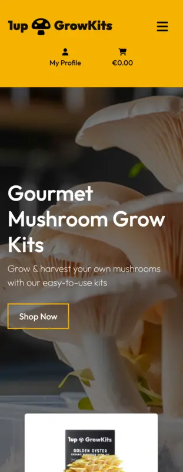 |
| **Navigation Bar**  
Primary navigation bar offering intuitive access to key site areas, including Products, Grow Guide, Courses, Contact, Shopping Bag & User Profile. |  |
| **Navigation Bar Mobile**  
Responsive hamburger menu ensuring smooth navigation on smartphones & tablets. |  |
| **Navigation Dropdown**  
User account management dropdown with links to login, signup, profile management & admin-only areas (for superusers). |  |
| **Featured Products Section**  
Highlighted mushroom kits selected by admin, encouraging users to explore premium or promoted products easily from the homepage. |  |
| **Featured Products Section Mobile**  
A clean, responsive featured section for mobile users, maintaining focus on special products. | 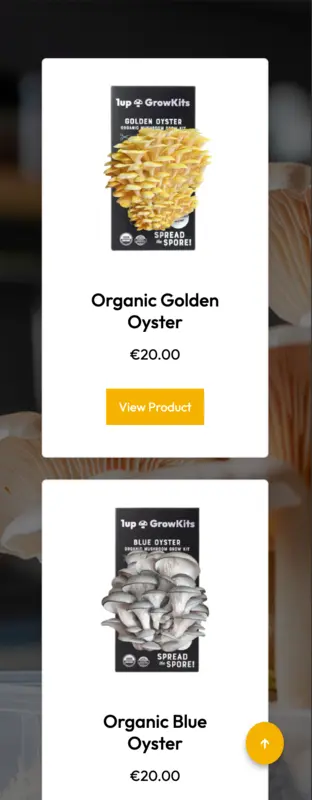 |
| **Footer**  
A consistent footer across all pages, featuring external SEO links, social media integration & an accessible scroll-to-top button. |  |
| **Footer Mobile**  
Mobile-optimized footer maintaining usability, visibility & accessibility compliance. |  |
| **Product Listings**  
Responsive product grid layout allowing users to browse available grow kits with pricing, images & stock status easily. |  |
| **Product Detail**  
Detailed single-product page offering pricing, description, stock availability & direct add-to-cart functionality. |  |
| **Product Listings Mobile**  
Responsive mobile-friendly product grid to ensure seamless shopping on small devices. | 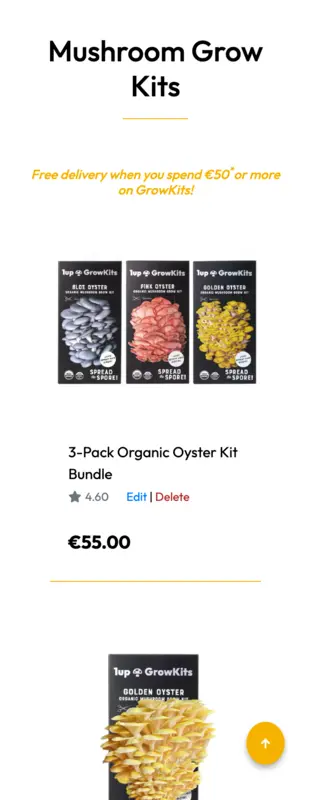 |
| **Product Detail Mobile**  
Optimized mobile view of product details with easy add-to-cart access & product descriptions. |  |
| **Grow Guide**  
Informational page providing detailed growing instructions, troubleshooting help & expert tips for beginners. |  |
| **Grow Guide Mobile**  
Streamlined, mobile-friendly version of the Grow Guide for easy reference on smaller screens. | 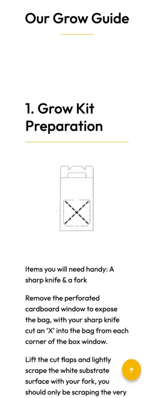 |
| **Course Registration**  
Course overview page listing available educational sessions with real-time space availability indicators. |  |
| **Course Detail**  
In-depth course details including date, time, location, attendee limits & space left for registration. |  |
| **Course Registration Mobile**  
Mobile-optimized course listings allowing booking & viewing of upcoming course details. | 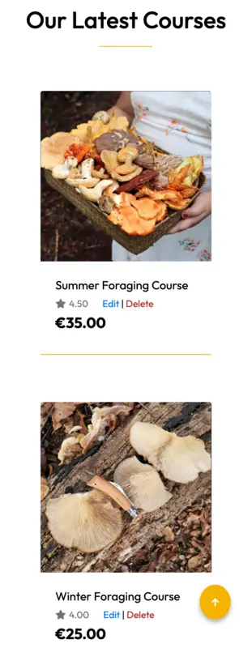 |
| **Course Detail Mobile**  
Mobile-friendly detailed course view showcasing session details & live availability. | 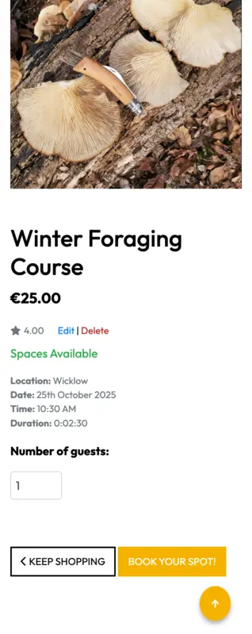 |
| **Shopping Bag**  
Session-based shopping bag allowing users to adjust quantities, remove items, or proceed to checkout with real-time updates. |  |
| **Add to Bag Alert**  
Modal popup confirming that a product has been successfully added to the bag. | 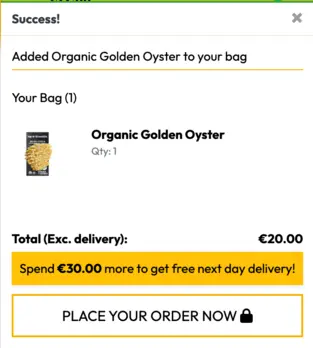 |
| **Delete from Bag Alert**  
Alert message confirming an item’s removal from the bag. | 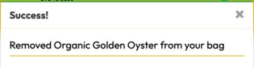 |
| **Update Bag Alert**  
Real-time notification after changing item quantities within the shopping bag. | 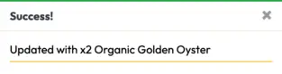 |
| **Checkout Desktop**  
Secure checkout flow integrated with Stripe, displaying billing, delivery details & an order summary. |  |
| **Shopping Bag Mobile**  
Mobile-optimized shopping bag allowing easy quantity adjustment & checkout progression. |  |
| **Checkout Mobile**  
Streamlined Stripe checkout experience designed for mobile users. |  |
| **User Authentication**  
Full authentication system allowing users to register, login, reset passwords & verify email addresses securely. | 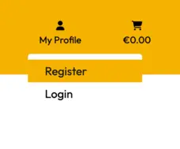 |
| **Signup Page**  
New user registration form requesting username, email & password. | 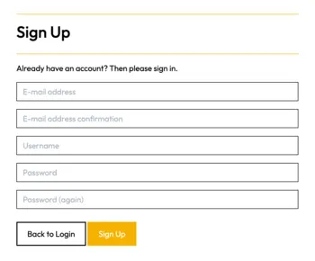 |
| **Email Verification Prompt**  
Instruction page guiding new users to verify their email addresses. | 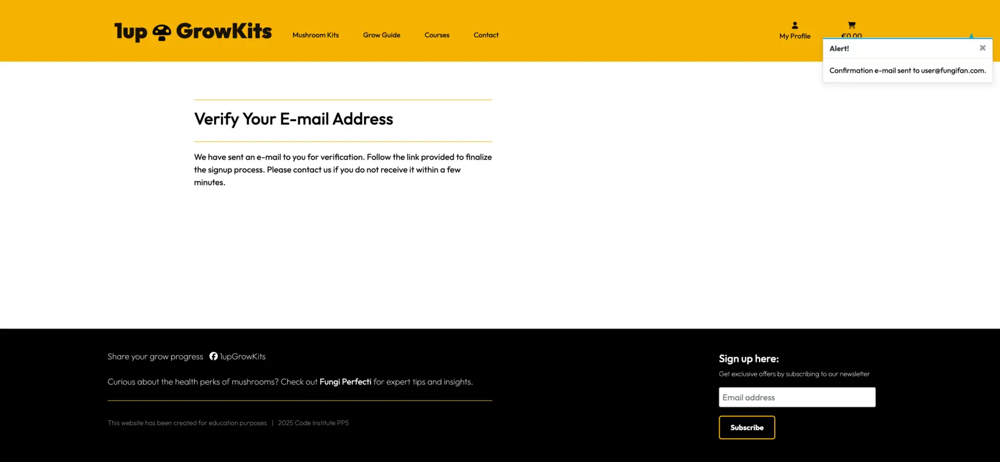 |
| **Email Confirmation Success**  
Confirmation message once a user's email address has been successfully verified. | 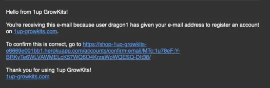 |
| **Login Page**  
User login form for account access using username & password. | 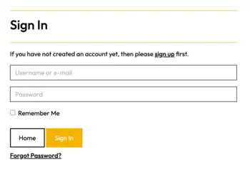 |
| **Password Reset Request**  
Password reset form allowing users to recover accounts securely. | 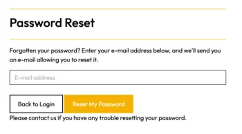 |
| **Order History**  
Account section showing users a summary of previous orders with downloadable confirmations. | 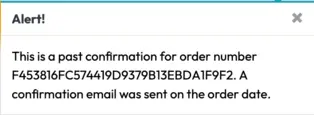 |
| **Profile Page**  
Profile management page where users can update personal details & delivery addresses. |  |
| **Newsletter Subscription**  
Mailchimp subscription form allowing users to opt-in for marketing emails, with GDPR-compliant consent. |  |
| **Newsletter Confirmation Page**  
Success page confirming that the subscription to the newsletter was completed. |  |
| **Newsletter Success Alert**  
Visual confirmation message appearing after a successful newsletter signup. |  |
| **Contact Form**  
Dedicated contact page for inquiries, product support, or general questions submitted to admin. |  |
| **Contact Form Confirmation**  
Success message shown to users after submitting the contact form. |  |
| **Error Pages**  
Custom-designed 404 error page guiding users back to the homepage if they reach a broken link. |  |


### Existing Admin Features

Admin users can manage the entire ecosystem of products, courses, & customer interactions through both the Django admin panel & the site interface. The system is designed for efficient backend management while also offering fast frontend editing tools for ease of use.

**Key Administrative Objectives:**
- Enable full CRUD (Create, Read, Update, Delete) control over products, courses, orders & users
- Allow dynamic content management, including Grow Guide updates without code changes
- Provide quick-access frontend management tools for products & courses
- Monitor stock levels & course availability through visual indicators
- Prevent out-of-stock sales & manage course enrollment limits proactively
- Streamline order fulfillment processes & customer communications
- Maintain full control over user profiles & submitted customer inquiries


| **Feature** | **Screenshot** |
|:------------|:---------------|
| **Admin Panel Overview**  
The Django admin dashboard provides secure, streamlined access to manage products, courses, orders, users & site content. Admins can perform all key actions through an intuitive interface without needing direct access to the database or codebase. |  |
| **Product Management via Admin**  
Admins can easily create, update, or delete mushroom grow kits directly through the admin interface, keeping the shop inventory dynamic & up-to-date. |  |
| **Course Management via Admin**  
Admins can manage available courses, edit course dates, attendee limits, pricing & visibility from a central dashboard. |  |
| **Grow Guide Content Management**  
Growing resources can be easily expanded by admins without coding, allowing new guides, tips, categories & images to be added dynamically through the CMS. | 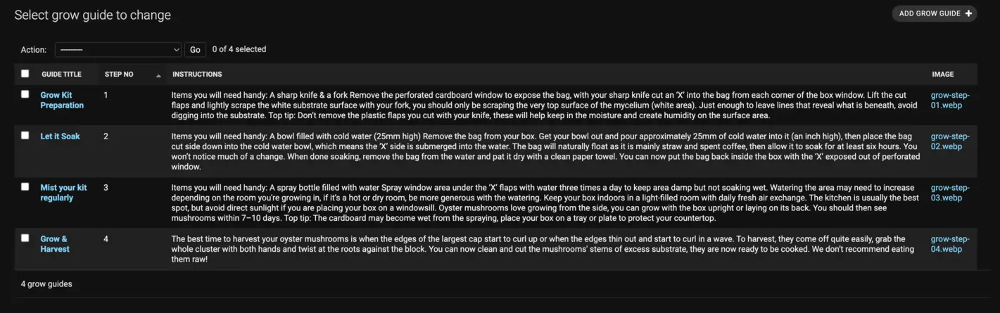 |
| **Admin Links in Navbar**  
Admin users have quick frontend access to manage products & courses via special links visible only when logged in with superuser privileges. |  |
| **Manage Products via Site Interface**  
For fast updates, admins can modify existing products or add new kits directly through the site frontend without using the admin backend. |  |
| **Manage Courses via Site Interface**  
Frontend access also enables admins to edit course details quickly, ideal for live changes like updating available seats or changing dates. |  |
| **Stock Alerts - Products**  
Custom stock counters alert admins visually when product inventory drops below pre-set thresholds, preventing overselling & managing customer expectations. | 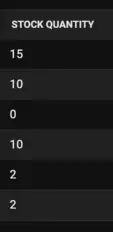 |
| **Stock Available**  
Green visual indicators confirm that stock levels are healthy, providing reassurance that products or courses are ready for sale. |  |
| **Low Stock Warning**  
Yellow warnings appear for products or courses nearing low stock levels, prompting timely restocks & stock planning. |  |
| **Out of Stock Warning**  
Red alerts flag products or courses that are completely out of stock, helping admins prevent further sales or manage waitlists. |  |
| **Courses Availability Alert**  
Course-specific enrollment tracking ensures that attendee spots are monitored in real time, allowing admins to manage fully booked classes or promote under-booked sessions. | 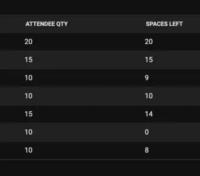 |
| **Spots Available**  
Visual "Spots Available" status helps both users & admins see when courses are open for new bookings. |  |
| **Low Availability Warning**  
Yellow availability warnings flag courses that are filling up fast, encouraging urgency among users & informing admin marketing strategies. |  |
| **Fully Booked Courses**  
Clear red indicators mark courses where all attendee spots are filled, helping manage course scheduling & additional session planning. |  |
| **Order Management**  
Admins can review all placed orders including customer details, line items, timestamps & payment status, providing full control over order processing & fulfillment. | 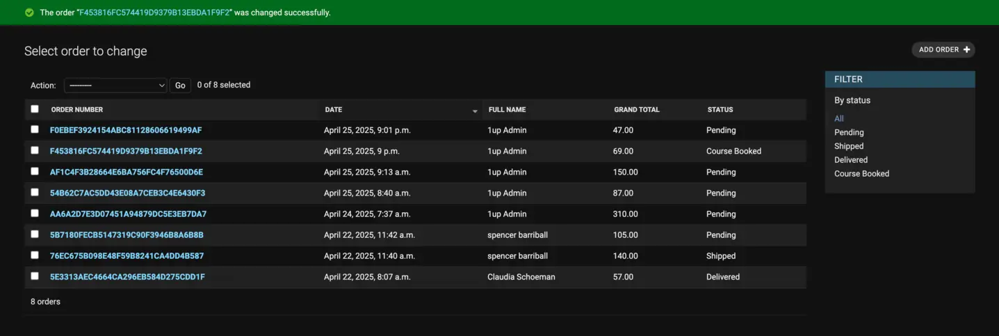 |
| **Course Enrollments via Admin**  
Admins have access to a detailed list of course enrollments generated automatically after a successful checkout, simplifying session management & attendance tracking. |  |
| **User Management**  
Admins can manage the site's userbase — viewing registered accounts, managing profile data, filtering users & handling submitted customer inquiries efficiently. |  |

### Future Features:

The following features are planned for possible future development to enhance user experience, boost engagement & scale website functionality:

| **Feature** | **Details** |
|:------------|:------------|
| **Product & Course Reviews** (Build trust & provide social proof) | (1) Logged-in users can leave reviews with optional star ratings<br>(2) Reviews displayed on product & course detail pages<br>(3) Admin moderation panel for managing posted content<br>(4) 'Most Loved' badge for products with high ratings |
| **Course Calendar** (Users can easily find available dates & register for upcoming courses) | (1) Calendar view for all scheduled courses<br>(2) Filter by level (beginner to advanced) or location (on-site / online)<br>(3) 'Book Now' button integrated into calendar view |
| **Wishlist** (Allow users to bookmark items they are interested in) | (1) Logged-in users can add products or courses to a personal wishlist<br>(2) 'Save Items' option available at checkout<br>(3) Wishlist accessible from the user's account dashboard |
| **Browse & Filter Products / Courses** (Help users easily find relevant items) | (1) Users can browse all available products & courses<br>(2) Filtering options for category, price & availability<br>(3) Option to clear filters & reset the browsing view |
| **Rewards Program** (Incentivize repeat purchases) | (1) Users earn points for purchases, referrals, reviews, or social shares<br>(2) Points displayed on user's profile<br>(3) Points redeemable for discounts, free products, or early access to new offerings |
| **Subscription Model** (Create recurring sales & convenience for users) | (1) Monthly or seasonal grow kit subscription options<br>(2) Auto-renew with Stripe integration<br>(3) Email reminders & subscription management from user dashboard |
| **Advanced Kit Customisation** (Allow users to build kits tailored to their needs) | (1) Choose strain, substrate type & grow experience level<br>(2) Dynamic pricing updates based on selections<br>(3) Helpful tips shown depending on chosen options |
| **Product Refills** (Encourage sustainable practices & repeat purchases) | (1) Users can reorder substrate or refill their kits<br>(2) Refill reminders via email based on typical grow cycles<br>(3) Bundled refill kits with digital grow guides offered |
| **Info Hub** (Free resources section for SEO value) | (1) Growing tips, troubleshooting articles & recipe blog posts<br>(2) Search & filter by topic or mushroom strain<br>(3) Embedded videos from YouTube channel |
| **Re-stock Alerts** (Capture demand for sold out products) | (1) Users can subscribe for email or SMS restock notifications<br>(2) Admins notified of high-demand waitlist items<br>(3) Automated user notifications when items are restocked |


## Agile Development

### Agile Workflow

An Agile development process was followed using GitHub Projects for sprint planning, user story tracking & task issue management. New user stories have been added as the project progressed & based on user feedback during the final testing phase.

### Project Issues


### Project Milestones


 

### MoSCoW Prioritisation:

- **Must Have:** Essential for MVP & launch
- **Should Have:** Important but not critical for MVP
- **Could Have:** Enhancements added in later sprints
- **Won’t Have:** Out of current scope

See agile [project boards here](https://github.com/users/SchoemanClaudia/projects/5/views/6)


## User Stories

User stories were used to keep track of the MOSCOW framework & project MVP as working through the project. 


### EPICS:
- [x] **EPIC 1:** User Authentication & Account Management
- [x] **EPIC 2:** Product Listings & E-commerce
- [x] **EPIC 3:** Checkout & Payment System
- [x] **EPIC 4:** Booking a Course Feature
- [x] **EPIC 5:** Subscription & Email Marketing
- [x] **EPIC 6:** UI / UX Enhancements & Social Links

| **USER STORY** | **DETAILS** | **ACCEPTANCE CRITERIA** |
| -------------- | ----------- | ----------------------- |
| **Register an account** | As a User / Admin, I want to register an account so that I can create a personal profile | (1) User/Admin can create an account with a username, email & password. (2) User/Admin receives a confirmation email upon successful registration.
| **Login & logout of account** | As a User / Admin, I want to log in & log out my account so that I can keep my profile secure | (1) User/Admin can log in using their username/email & password. (2) A "Remember Me" option is available for convenience. (3) Users/Admin can log in / out out at any time via site header.
| **Manage user accounts** | As an Admin, I want to access user profiles from admin panel so that I can manage user accounts | (1) Admins can view, activate & deactivate user accounts. (2) Admins can manually reset user passwords if needed.
| **Browse products & courses** | As a User, I want to view available mushroom grow kits & course so that I can decide before making purchase | (1) Products are displayed with images, descriptions, prices & quantity panel. (2) A dedicated page for mushroom-growing courses with with images, descriptions & prices.
| **Detailed product & course view** | As a User, I want to view a product & course details so that I can see in depth details before making purchase | (1) Clicking a product / course opens a detailed page with full descriptions, stock levels & images. (2) If the item is out of stock or course fully booked, an automated message is displayed.
| **Add featured items** | As a User, I want to view a product & course details so that I can see in depth details before making purchase | (1) Clicking a product / course opens a detailed page with full descriptions, stock levels & images. (2) If the item is out of stock or course fully booked, an automated message is displayed.
| **Add to shopping cart** | As a User, I want to add items to my shopping cart so that I can continue browsing | (1) User can add multiple products to their cart. (2) The cart updates dynamically with quantity & total price.
| **Update items in cart** | As a User, I want to update my shopping cart so that I can or add or remove items | (1) User can increase / decrease item quantity. (2) User can remove items from the cart before checkout.
| **Secure card payment checkout** | As a User, I want to I want to securely pay for my order so that I can place order effortlessly | (1) User enters shipping details. (2) Card payment is processed via Stripe securely. (3) A confirmation email is sent upon successful payment. (4) Error messages if card payment is not successful, prompting user. (5)Order not processed if declined, keep order payment pending.
| **Order summary display** | As a User, I want to see an order summary so that I can review items before completing checkout | (1) User can review products, quantities & final prices before payment.
| **Order management** | As an Admin, I want to see successful orders in admin panel so that I can manage customer orders | (1) Orders appear in the Admin panel. (2) Admin can update order status (Pending, Shipped, Delivered). (3) Admin can search & sort orders by date, status & user.
| **Successful order email** | As an Admin, I want to receive a confirmation email after purchase so that I can see my order has been placed successfully | (1) An email is automatically sent to user with order confirmation.
| **Product & course management** | As an Admin, I want to add, edit & delete items so that edit & add new products / courses easily | (1) Admin can add, edit & delete products / courses via the Admin dashboard. (2) Admin can add, edit & delete products / courses directly on site when logged in as an admin.
| **Auto low-stock warning** | As an Admin, I want to see stock levels & a low-stock warning so that I can manage restocking easily | (1) If stock is below 5 units, a warning appears. (2) If stock is 0, the product is marked as "Out of Stock".
| **Booking a course** | As a User, I want to book a mushroom-growing course so that I can learn more about mushrooms | (1) Courses are listed separately on a dedicated page. (2) User can select a course & pay for the course as a product. (3) User receives an email confirming course registration, after successful payment upon checkout.
| **Social media profile** | As a User, I want to follow 1up GrowKits on facebook so that I can share my mushroom growing journey | (1) User can access facebook profile page via footer link. (2) Social profile contains logo, recent user post tags & latest news.
| **Optimize with Google SEO** | As a Developer, I want the website to be optimised for Google SEO so that the site can be top of mind when user searched mushroom grow kits | (1) Meta tags are correctly structured for SEO.
| **User logged in for checkout** | I want users to be logged into their profile before proceeding with checkout so that they can have their orders linked & traced back to their profiles | (1) If user is logged in already: CTA on bag view directs user to checkout page with delivery details & Stripe payment option. (2) If user is not logged in: User is directed to login / register page. (3) Once user is successfully logged in, they are redirected back to checkout view to place order successfully.


## Site Testing 

Please see [TESTING.md](TESTING.md) document.


## UX/UI Wireframing

**Key wireframes include:**

| **Page** | **Description** |
|:-------------------|:----------------|
| **Landing** | Shop products access from hero section & featured product cards. |
| **Product** | View individual product details & add to cart. |
| **Grow Guide** | Step-by-step guide to growing mushrooms with the grow kit. |
| **Course Booking** | Available courses listed with dates, registration options, & "Book Spot" buttons. |
| **Contact** | Form field to send user messages directly to admin via email & admin panel. |
| **Cart & Checkout** | Display of item list, total price calculation & Stripe integration for secure payment. |
| **Profile** | Manage user delivery details & view previous order history. |
| **Admin Panel** | Full CRUD functionality for product, course & order management. |


### Wireframe


### UI Colour Palette


### User Experience

__User Feedback__

Site was deployed after all styling & error handling was in place. An up-to-date URL was sent to a small group of users to gather feedback on navigation, layout structure, & potential issues they might encounter as while working through the site. 
- [x] This feedback was actioned & added for better user experience.

**Users were asked to:**
- [x] Navigate from homepage to product & course pages
- [x] Add items to the shopping bag & proceed through checkout
- [x] Confirm receipt of real emails for order & course enrollment
- [x] Test mobile responsiveness & layout on smaller screens
- [x] Send a message via contact form, confirm success page
- [x] Try subscribing to the newsletter
- [x] Report any broken links or unexpected errors


| **No.** | **Feedback** | **Action** | **Outcome** |
|:-------:|:-------------|:-----------|:------------|
| 1 | Mobile view of the shopping bag was cluttered | Restructured layout for smaller screens | Clearer mobile interface, with product / course & total info easier to read |
| 2 | Button styling inconsistent between bag & checkout | Unified button classes & layout across pages | Improved visual consistency & professionalism |
| 3 | Course details page missing availability indicator | Added 'Spaces Left' | Users better informed before adding to bag |
| 4 | Product images were too large on mobile | Adjusted image sizing with responsive CSS rules | Improved load times & visual clarity on smaller screens |
| 5 | Users overlooked course start dates & durations | Enhanced course cards with date, time, & duration info | Improved clarity, leading to more informed bookings |


## Solution Model

**Primary Models:**

| **Model** | **Description** |
|:----------|:----------------|
| **UserProfile** | Stores customer details linked to Django’s built-in User model. |
| **Product** | Represents mushroom grow kits available for purchase. |
| **Course** | Represents educational events such as mushroom growing workshops. |
| **Order** | Stores information about product & course purchases by users. |
| **Cart** | Handles session-based shopping cart items before checkout. |
| **Payment** | Processes transactions securely using Stripe integration. |
| **StockAlert** | Tracks low inventory alerts for products & courses. |
| **NewsletterSubscription** | Manages email opt-ins & subscriptions via Mailchimp integration. |


### ERD & Database Design

**Product**
- id (AutoField, Primary Key)
- item (CharField, Unique)
- description (TextField)
- price (DecimalField)
- image (ImageField)
- stock_quantity (IntegerField)
- low_stock_indicator (BooleanField) – Admin Only
- created_at (DateTimeField) – Admin Only

**Course**
- id (AutoField, Primary Key)
- title (CharField, Unique)
- description (TextField)
- location (CharField)
- duration (DurationField)
- attendee_qty (IntegerField)
- price (DecimalField)
- image (ImageField)

**Cart**
- id (AutoField, Primary Key)
- user (ForeignKey to User)
- product (ForeignKey to Product)
- quantity (IntegerField)

**Order**
- id (AutoField, Primary Key)
- user (ForeignKey to UserProfile)
- product (ForeignKey to Product, Nullable)
- course (ForeignKey to Course, Nullable)
- total_price (DecimalField)
- status (CharField: Pending, Completed, Cancelled)
- created_at (DateTimeField)

**StockAlert** – Admin Only
- id (AutoField, Primary Key)
- product (ForeignKey to Product)
- stock_threshold (IntegerField)
- alert_sent (BooleanField)

A detailed first look at ERD & database models below:


## Technologies Used

### Languages

__Application Structure__

| **Frontend** |    |
|:-------------|:---|
| **HTML** | Provides the main content & structure of the site. |
| **CSS** | Defines the styling, layout & visual presentation of the site. |
| **JavaScript** | Enables user interactions & dynamic behaviour on the frontend. |
| **Bootstrap** | CSS framework used for responsive design & pre-built UI components. |
| **Crispy Forms** | Formats Django forms to use Bootstrap styles for a consistent look. |


| **Backend** |    |
|:------------|:---|
| **Python** | Core backend programming language powering the application logic. |
| **Django** | High-level Python web framework used for rapid backend development. |
| **PostgreSQL** | Relational database management system for storing application data. |
| **psycopg2** | PostgreSQL adapter allowing Django to interact with the PostgreSQL database. |
| **Stripe** | Secure payment gateway integrated for processing orders & course bookings. |
| **Django Allauth** | Library handling user authentication, registration, login & email verification. |
| **Pillow** | Python library used for image uploading & processing for products & courses. |


| **Development Tools:** |    |
|:-----------------------|:---|
| **Git** | Version control system used for tracking changes in the project (`git add`, `git commit`, `git push`). |
| **GitHub** | Remote code repository & collaboration platform for version control & backups. |
| **VS Code** | Integrated Development Environment (IDE) used for coding, debugging & project management. |


| **Hosting & Deployment:** |    |
|:--------------------------|:---|
| **Heroku** | Cloud platform used for hosting & deploying the Django web application. |
| **AWS S3** | Amazon Web Services storage service used for hosting static & media files. |
| **Gunicorn** | WSGI HTTP server used to run Django apps in a production environment. |


### Libraries & Frameworks

The following libraries & frameworks were used to enhance functionality, improve user experience & support deployment:

- **Backend & Django:**
  - `Django` – Core web framework
  - `django-allauth` – User authentication, registration & social login
  - `django-crispy-forms` – Bootstrap styled form rendering
  - `django-storages` – AWS S3 integration for static / media file storage
  - `dj-database-url` – Simplifies database configuration for Heroku
  - `whitenoise` – Serves static files in production
  - `gunicorn` – WSGI server for deployment
  - `pillow` – Image handling for uploaded content

- **Frontend:**
  - `Bootstrap` (via CDN) – Responsive front-end framework
  - `jQuery` (via CDN) – DOM manipulation & cart interactivity

- **Payment Integration:**
  - `stripe` – Secure online payments
  - `PyJWT` – Token-based authentication (used by Stripe & others)

- **AWS Integration:**
  - `boto3` – AWS SDK for Python
  - `botocore` – Dependency of boto3
  - `s3transfer` – Helper for file transfer management in S3

- **Database:**
  - `psycopg2-binary` – PostgreSQL driver
  - `sqlparse` – SQL formatting for Django migrations

- **Security & Email:**
  - `cryptography`, `cffi`, `pycparser` – Secure cryptographic operations
  - `requests`, `requests-oauthlib` – Secure API / OAuth integrations
  - `python3-openid`, `oauthlib` – Social login support
  - `defusedxml` – XML security

- **Utilities & Linting:**
  - `flake8`, `pyflakes`, `pycodestyle`, `mccabe` – Code quality checks
  - `setuptools`, `typing_extensions` – Development utilities & type hinting support


### Sitemap
I used XML-Sitemaps to generate a sitemap.xml file. This was generated using my deployed site URL:
  - https://shop-1up-growkits-e6669e001bb1.herokuapp.com/

After it finished crawling the entire site, it created a sitemap.xml which I've downloaded & included in the repository.

### Robots
I've created the robots.txt file at the root-level. Inside, I've included the default settings:

`User-agent: *`
`Disallow:`
`Sitemap: https://shop-1up-growkits-e6669e001bb1.herokuapp.com/sitemap.xml`

- **Further links for future implementation::**
  - [Managing your sitemaps & using sitemaps reports](https://support.google.com/webmasters/answer/7451001)
  - [Creating & submitting a sitemap](https://developers.google.com/search/docs/crawling-indexing/sitemaps/build-sitemap)
  - [Google search console](https://search.google.com/search-console/welcome)
  - [Testing the robots.txt file](https://support.google.com/webmasters/answer/6062598)


### Other Sites

- Testing & Validation
  - HTML: https://validator.w3.org/nu/
  - CSS: https://jigsaw.w3.org/css-validator/#validate_by_uri
  - JavaScript: https://jshint.com/
  - Python: https://pep8ci.herokuapp.com/
  - Accessibility: https://wave.webaim.org/

- Responsive Screen Preview
  - MockUp Generator: https://websitemockupgenerator.com/

- Images downloaded under licensed user
  - Adobe Stock: https://stock.adobe.com/

- Free images downloaded 
  - Pexels: https://www.pexels.com/search/mushroom%20grow%20kit/

- Grow kit box products original
  - Northspore: https://northspore.com/
  - Version with 1up GrowKit logo - edited with Adobe Photoshop

- Facebook Mockup Template 
  - CI Supplied template: https://code-institute-org.github.io/5P-Assessments-Handbook/files/Facebook_Mockups.zip
  - Version with 1up GrowKit details - edited with Adobe Photoshop

- Turning FontAwesome icon into sized favicons
  - Favicon: https://favicon.io/

- Contrast checker for accessibility:
  - Webaim: https://webaim.org/
    
- Image assets reduced with online platforms
  - TinyPNG: https://tinypng.com/
  - Bulk Sizing: https://imageresizer.com/bulk-resize/
  - Reduce Images: https://www.reduceimages.com/

- Assisted problem solving sites:
  - [Django Official Documentation](https://docs.djangoproject.com/en/stable/)
  - [Django Allauth Documentation](https://django-allauth.readthedocs.io/en/latest/)
  - [Simple is Better Than Complex](https://simpleisbetterthancomplex.com/)
  - [Django Email Settings Docs](https://docs.djangoproject.com/en/stable/topics/email/)
  - [Django Allauth GitHub Repo](https://github.com/pennersr/django-allauth)
  - [Stack Overflow](https://stackoverflow.com/questions/tagged/django)
  - [robots.txt Guide](https://developers.google.com/search/docs/crawling-indexing/robots/robots_txt)


## Django Project Setup

##### (1) Install Django & Supporting Libraries
```bash
pip3 install 'django<4' gunicorn
pip3 install dj_database_url psycopg2
```

Once the relevant dependencies are installed, generate a `requirements.txt` file to track them:

```bash
pip3 freeze --local > requirements.txt
```

##### (2) Create Your Django Project & App
```bash
django-admin startproject growkits .
python3 manage.py startapp home
```

Add your new app to `INSTALLED_APPS` in `settings.py`:

```python
'home',
```

##### (3) Create a Superuser
To enable admin access:

```bash
python3 manage.py createsuperuser
```

##### (4) Run Migrations
```bash
python3 manage.py migrate
```

##### (5) Set Up Environment Variables
Create an `env.py` file to store sensitive information like `DATABASE_URL` & `SECRET_KEY`.

```python
import os

os.environ["DATABASE_URL"] = "<copiedURLfromPostgres/SQLite>"
os.environ["SECRET_KEY"] = "my_super^secret@key"
```

Add `env.py` to your `.gitignore` to keep it out of version control.
##### (6) Update `settings.py` to Use Environment Variables

```python
import os
import dj_database_url

if os.path.exists("env.py"):
    import env

SECRET_KEY = os.environ.get('SECRET_KEY')

DATABASES = {
    'default': dj_database_url.parse(os.environ.get("DATABASE_URL"))
}
```

##### (7) Set Up the Templates Directory
In `settings.py`, add:

```python
TEMPLATES_DIR = os.path.join(BASE_DIR, 'templates')
```

Update the `DIRS` section of `TEMPLATES`:

```python
'DIRS': [
    os.path.join(BASE_DIR, 'templates'),
    os.path.join(BASE_DIR, 'templates', 'allauth'),
],
```

##### (8) Create Media, Static & Templates Directories
Inside the top-level project directory (same level as `manage.py`), create:

- `media/`
- `static/`
- `templates/`

##### (9) Prepare for Heroku Deployment
Create a `Procfile` in the root of your project & add:

```
web: gunicorn growkits.wsgi
```

##### (10) Finalize Setup
Make any necessary migrations:

```bash
python3 manage.py migrate
```


## Deployment

### AWS Cloud Service
**Amazon Web Services (AWS)** used to store 1up GrowKits' static & media files securely, for fast & reliable access.

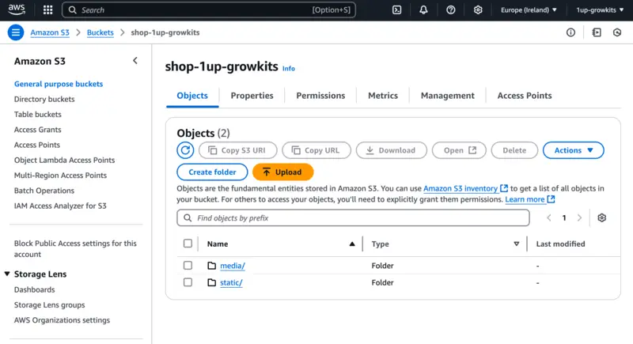

#### Steps to Set Up AWS:

##### (1) Create & Configure an S3 Bucket
- **Login** to your AWS Management Console
- Go to **S3** & create a new bucket with a globally unique name
- Choose a region closest to your user base

**Public Access & Ownership:**
- Uncheck "Block all public access"
- Under Object Ownership, select "ACLs enabled" & "Bucket owner preferred"

**Enable Static Website Hosting:**
- In the "Properties" tab, enable static website hosting
- Set `index.html` & `error.html` as the default documents

**CORS Configuration:**
```json
[
  {
    "AllowedHeaders": ["Authorization"],
    "AllowedMethods": ["GET"],
    "AllowedOrigins": ["*"],
    "ExposeHeaders": []
  }
]
```

**Bucket Policy:**
```json
{
  "Version": "2012-10-17",
  "Statement": [
    {
      "Effect": "Allow",
      "Principal": "*",
      "Action": "s3:GetObject",
      "Resource": "arn:aws:s3:::your-bucket-name/*"
    }
  ]
}
```

**Access Control List (ACL):**
- Enable "List" for public access

##### (2) Configure IAM

**Create a User Group:**
- Go to IAM > User Groups > Create New Group
- Name it (eg. `group-1up-growkits`)

**Attach Policies:**
- Attach `AmazonS3FullAccess` policy
- Modify it:

```json
{
  "Version": "2012-10-17",
  "Statement": [
    {
      "Effect": "Allow",
      "Action": "s3:*",
      "Resource": [
        "arn:aws:s3:::your-bucket-name",
        "arn:aws:s3:::your-bucket-name/*"
      ]
    }
  ]
}
```

**Create a User:**
- Enable Programmatic Access
- Assign to the group
- Download credentials CSV (AWS_ACCESS_KEY_ID & AWS_SECRET_ACCESS_KEY)

##### (3) Final AWS Setup
- Remove `DISABLE_COLLECTSTATIC` from Heroku Config Vars
- Create a `media/` directory in your S3 bucket
- Upload files & set public access

**Security:** 
- Never commit AWS credentials in source code
- Create env.py to keep keys secure


### Stripe Integration
- Stripe is used to process payments securely

#### Stripe Setup:
(1) Create a Stripe account & login
(2) Retrieve:
   - `STRIPE_PUBLIC_KEY`
   - `STRIPE_SECRET_KEY`

(3) Setup Webhooks:
   - Go to **Developers > Webhooks > Add Endpoint**
   - URL: `https://your-site.com/checkout/wh/`
   - Events: "Receive all events"
   - Copy `STRIPE_WH_SECRET`

(4) Use Test Mode:
   - Card: `4242 4242 4242 4242`
   - Expiry: Any future date
   - CVC: Any 3-digit number

- Store keys in Heroku Config Vars or secure .env files, never exposed in code.
- Webhook endpoints are verified using Stripe's provided signing secret, ensuring authenticity of requests.


### Gmail SMTP Integration
Used to send transactional emails (confirmations, resets etc.)

#### Setup:
(1) Enable 2FA on Gmail account
(2) Create App Password:
   - Go to Security > App Passwords
   - Choose "Mail" > Other > Enter name (eg. DjangoApp)
   - Copy 16-digit password

(3) Update settings in Django:

```python
EMAIL_HOST_USER = 'your-email@gmail.com'
EMAIL_HOST_PASSWORD = 'your-app-password'
```
- Use environment variables to store these securely

### Heroku Deployment
(1) Login to [Heroku](https://heroku.com)
(2) Create a new app
(3) In **Settings > Config Vars**, add:
   - `SECRET_KEY`
   - `AWS_ACCESS_KEY_ID`
   - `AWS_SECRET_ACCESS_KEY`
   - `AWS_STORAGE_BUCKET_NAME`
   - `EMAIL_HOST_USER`
   - `EMAIL_HOST_PASSWORD`
   - `STRIPE_PUBLIC_KEY`
   - `STRIPE_SECRET_KEY`
   - `STRIPE_WH_SECRET`
   - `USE_AWS=True`

(4) Link GitHub repo in **Deploy** tab
(5) Click **Deploy Branch**
(6) Ensure:
   - `DEBUG=False` in `settings.py`
   - Heroku URL is in `ALLOWED_HOSTS`
   - `requirements.txt` & `Procfile` are committed

### Forking the Project
(1) Go to the GitHub repo
(2) Click **Fork** (top-right corner)

### Cloning the Project
(1) Click **Code** & copy the repo URL
(2) In your terminal:

```bash
git clone https://github.com/your-username/repo-name.git
```

(3) Navigate into the project directory & install dependencies

- Ensure sensitive keys are stored securely
- Regularly update your dependencies & monitor for security updates


## Credits 

- Boutique Ado Walkthrough Project:
  - Various code sections throughout the site were adapted from the Code Institute's Boutique Ado walkthrough project as a basis to build 1up GrowKits.

- Product images & info within site:
  - [Northspore](https://northspore.com/)

- Course images & info used within site:
  - [Siolta Chroi](https://sioltachroi.ie/product/mushroomcultivationworkshop/)
  - [irish Seed Savers](https://irishseedsavers.ie/product/mushroom-foraging-saturday-11th-october/)
  - [Hips & Haws Wildcrafts](https://hipsandhaws.com/medicinal-mushrooms-workshop/)
  - [Black Mountains College](https://blackmountainscollege.uk/short-courses/introduction-to-mushroom-cultivation-short-course/) 
  - [The Herbal Academy](https://theherbalacademy.com/product/the-mushroom-course/?srsltid=AfmBOor4pwi7dPUG66oYasLRtTEr99ij-YvRp16W8Whl9_6Hhf-WtWhS) 
  - [GroCycle](https://grocycle.com/mushroom-cultivation-courses/) 
  - [Pexels](https://www.pexels.com/) 
  - [Unsplash](https://unsplash.com/)

- Logo Mushroom Icon:
  - [Freepik](https://www.freepik.com/)

- Adobe Stock Images (licensed): 
  - https://stock.adobe.com/ie/images/indoor-mushroom-grow-kit-with-fresh-pink-oyster-mushrooms-on-a-kitchen-table-concept-home-gardening-sustainable-living-diy-culinary-modern-trendy-healthy-food/873123243?prev_url=detail

- Used throughout the site to compress & optimize images for faster loading times and improved performance:
  - [TinyPNG](https://tinypng.com/)

- Helped reinforce concepts used to build modern, responsive Flexbox-based layouts across the site:
  - [Flexbox Froggy](https://flexboxfroggy.com/)

- Resources used for resolving specific Django issues:
  -  [Code Institute Full Stack Development course materials](https://codeinstitute.net/global/full-stack-software-development-diploma/) 
  - [Simple is Better Than Complex](https://simpleisbetterthancomplex.com/)
  - [Django documentation](https://www.djangoproject.com/)
  - [Crispy forms docs](https://django-crispy-forms.readthedocs.io/en/latest/)
  - [Bootstrap docs](https://getbootstrap.com/docs/5.0/getting-started/introduction/)
  - [Stack overflow](https://stackoverflow.com/)
  - [Slack](https://slack.com/intl/en-ie/)


## Acknowledgements

- A huge thanks to my husband for his continued support during this project & the past year of completing this diploma.

- Tutor Assist for the support when debugging became overwhelming.

- My mentor & facilitator for the support & knowledge shared.

- Slack channel peers for their feedback & support with errors.