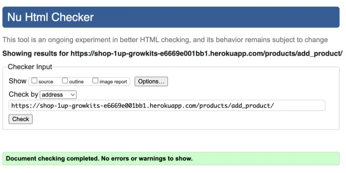
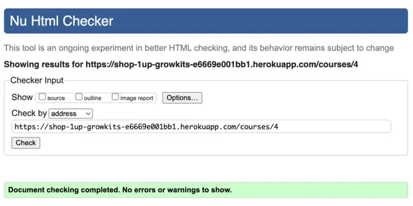
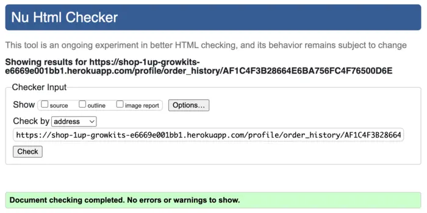

# Testing

Testing file for 1up GrowKits [README.md](README.md).

## Testing User Stories

### Developer Stories

- [x] Frontend and Backend of the project created.
- [x] Database is connected to the project.
- [x] App deployed on Heroku.

### User Stories

- [x] Register an account
- [x] Login & logout of account
- [x] Manage user accounts
- [x] Browse products & courses
- [x] Detailed product & course view
- [x] Add featured items
- [x] Add to shopping cart
- [x] Update items in cart
- [x] Secure card payment checkout
- [x] Order summary display
- [x] Order management
- [x] Successful order email
- [x] Product & course management
- [x] Auto low-stock warning
- [x] Booking a course
- [x] Social media profile
- [x] Optimize with Google SEO

## Validation

### Validation Errors

| **HTML Validation Issue** | **Description** |
|:---------------------------|:----------------|
| Duplicate attribute `rel` on `<link>` tags | Multiple `rel` attributes found on the same `<link>` element |
| Missing `type="button"` on non-form `<button>` | Buttons not inside forms should explicitly declare `type="button"` |
| Using `
` directly inside a `<ul>` | Invalid HTML structure; `<ul>` should only contain `<li>` elements |
| Button missing `type="submit"` | Form submit buttons missing an explicit `type="submit"` attribute |
| Empty `<a href="">` if no image exists | Empty anchor tags if an image is missing from inside the link |
| `
` inside `<strong>` not valid | Block-level `
` tags incorrectly placed inside inline `<strong>` tags |
| No `alt` fallback if `product.image` is missing | Missing descriptive text for images when `product.image` is not available |
| Empty `

` | Empty `
` without meaningful content |
| Missing closing `
` for button container | Unclosed `
` leading to HTML structure errors |
| No `<label>` explicitly for form fields | Form inputs missing associated `<label>` elements |
| Empty ` ` tag inside `
` | Improper use of empty ` ` tag within a paragraph |
| Misplaced closing `
` | Closing a `
` tag at the wrong location, breaking layout |
| Trailing slash on void elements | Unnecessary trailing `/` on self-closing tags in HTML5 |
| No `
` element in scope but a `
` end tag | `
` tag used without an open `
` tag |
| Stray end tag `
` | Extra or misplaced `
` without a matching open tag |

### HTML Validation Corrected
Testing using the recommended [HTML W3C Validator](https://validator.w3.org/) to validate all of my HTML files.
- [x] HTML validation all passed:

**Home page**  

**Signup Page**  

**Login Page**  

**Logout Page**  

**Products Page**  

**Product Detail Page**  

**Add Product Page**  

**Edit Product Page**  

**Grow Guide Page**  

**Course Page**  

**Course Detail Page**  

**Add Course Page**  

**Edit Course Page**  

**Contact Page**  

**Message Sent Page**  

**Bag Page**  

**Checkout Page**  

**Checkout Success Page**  

**Profile Page**  

**Order History Page**  

### Validation Errors

| **CSS Validation Issue** | **Description** |
|:-------------------------|:----------------|
| Invalid CSS property `text-decoration-style: none;` | `text-decoration-style` does not accept `none`; corrected |

### CSS Validation Corrected
Testing using the recommended [CSS Jigsaw Validator](https://jigsaw.w3.org/css-validator/) to validate all of my CSS files.
- [x] CSS validation all passed.

**base.css**  

**profile.css**  

**checkout.css**  

### JSHint

### Validation Errors

| **JavaScript Validation Issue** | **Description** |
|:---------------------------------|:----------------|
| `console` undefined | Added `/* global console */` comment to declare `console` as a global variable |

### JavaScript Validation Corrected
Testing using the recommended [JShint Validator](https://jshint.com/) to validate all of my JavaScript files.
- [x] JavaScript tests all passed.

**bag.js**  

**countryfield.js**  

**admin_message.js**  

**stripe_element.js**  

### CI Python Linter
Testing using the recommended [PEP8 CI Python Linter](https://pep8ci.herokuapp.com/) to validate all of my Python files.
- [x] Python tests all passed.

During development, code quality was maintained by following the [PEP8](https://peps.python.org/pep-0008/) style guide for Python. Errors & warnings were detected & corrected accross apps by running flake8.
    
Common issues that were identified and resolved included:
| **Issue** | **Action Taken** |
|:----------|:-----------------|
| Lines exceeding 79 characters (E501) | Broken into multiple lines for readability |
| Trailing whitespace (W291) and blank lines with whitespace (W293) | Cleaned up for clarity and consistency |
| Missing or insufficient blank lines after class or function definitions (E302, E305) | Added blank lines to improve code structure |
| Unused imports (F401) and unused variables (F841) | Removed unused code for a cleaner, efficient codebase |
| Missing newlines at end of files (W292, W391) | Added newlines to meet formatting standards |

    All Python files containing the project's code have been tested, and the errors were fixed.
    After running the CI Python Linter, it shows there are no errors.

| **Feature** | **admin.py** | **apps.py** | **models.py** | **urls.py** | **views.py** | **forms.py** | **tests.py** | 
| ----------- |:------------:|:-----------:|:-------------:|:-----------:|:------------:|:------------:|:------------:|
| 1up GrowKits main app | n/a | n/a | n/a | [no errors](static/documentation/testing/main-urls.webp) | [no errors](static/documentation/testing/main-views.webp) | n/a | n/a |
| home | n/a | [no errors](static/documentation/testing/home-apps.webp) | n/a | [no errors](static/documentation/testing/home-urls.webp) | [no errors](static/documentation/testing/home-views.webp) | n/a | [no errors](static/documentation/testing/home-test.webp) |
| products | [no errors](static/documentation/testing/products-admin.webp) | [no errors](static/documentation/testing/products-apps.webp) | [no errors](static/documentation/testing/products-models.webp) | [no errors](static/documentation/testing/products-urls.webp) | [no errors](static/documentation/testing/products-views.webp) | [no errors](static/documentation/testing/products-forms.webp) | [no errors](static/documentation/testing/products-test.webp) |
| guide | [no errors](static/documentation/testing/guide-admin.webp) | [no errors](static/documentation/testing/guide-apps.webp) | [no errors](static/documentation/testing/guide-models.webp) | [no errors](static/documentation/testing/guide-urls.webp) | [no errors](static/documentation/testing/guide-views.webp) | n/a | [no errors](static/documentation/testing/guide-test.webp) |
| courses | [no errors](static/documentation/testing/courses-admin.webp) | [no errors](static/documentation/testing/courses-apps.webp) | [no errors](static/documentation/testing/courses-models.webp) | [no errors](static/documentation/testing/courses-urls.webp) | [no errors](static/documentation/testing/courses-views.webp) | [no errors](static/documentation/testing/courses-forms.webp) | [no errors](static/documentation/testing/courses-test.webp) |
| bag | n/a | [no errors](static/documentation/testing/bag-apps.webp) | n/a | [no errors](static/documentation/testing/bag-urls.webp) | [no errors](static/documentation/testing/bag-views.webp) | n/a | [no errors](static/documentation/testing/bag-test.webp) |
| checkout | [no errors](static/documentation/testing/checkout-admin.webp) | [no errors](static/documentation/testing/checkout-apps.webp) | [no errors](static/documentation/testing/checkout-models.webp) | [no errors](static/documentation/testing/checkout-urls.webp) | [no errors](static/documentation/testing/checkout-views.webp) | [no errors](static/documentation/testing/checkout-forms.webp) | [no errors](static/documentation/testing/checkout-test.webp) |
| profiles | n/a | [no errors](static/documentation/testing/profiles-apps.webp) | [no errors](static/documentation/testing/profiles-models.webp) | [no errors](static/documentation/testing/profiles-urls.webp) | [no errors](static/documentation/testing/profiles-views.webp) | n/a | [no errors](static/documentation/testing/profiles-test.webp) |
| contact | [no errors](static/documentation/testing/contact-admin.webp) | [no errors](static/documentation/testing/contact-apps.webp) | [no errors](static/documentation/testing/contact-models.webp) | [no errors](static/documentation/testing/contact-urls.webp) | [no errors](static/documentation/testing/contact-views.webp) | [no errors](static/documentation/testing/contact-forms.webp) | [no errors](static/documentation/testing/contact-test.webp) |

| **Feature** | **contexts.py** | **signals.py** | **webhook_handler.py** | **webhooks.py** | **utils.py** |
|-------------|:---------------:|:--------------:|:----------------------:|:---------------:|:-------------:|
| bag | [no errors](static/documentation/testing/bag-contexts.webp) | n/a | n/a | n/a | [no errors](static/documentation/testing/bag-utils.webp)
| checkout | n/a | [no errors](static/documentation/testing/checkout-signals.webp) | [no errors](static/documentation/testing/checkout-webhook-handler.webp) | [no errors](static/documentation/testing/checkout-webhooks.webp)| n/a

## Backend Testing
Automated backend testing has been implemented across all apps using Django’s built-in TestCase framework. Each app has its own test.py file containing unit and view tests. All tests are [PEP8](https://peps.python.org/pep-0008/) compliant & validate the critical functionality of models, forms, views & session handling.

__Apps tested:__
- [x] home
- [x] products
- [x] guide
- [x] courses
- [x] bag
- [x] checkout
- [x] profiles
- [x] contact

| **Testing Includes** | **Description** |
|:--------------|:----------------|
| **Model String Representations** | Tests that model `__str__` methods return correct readable strings. |
| **Model Properties & Methods** | Tests custom model properties like `spaces_left` and stock quantity management. |
| **Form Validations** | Ensures forms validate correctly with valid and invalid inputs. |
| **View Responses & Template Rendering** | Verifies correct HTTP responses and that the correct templates are rendered. |
| **Access Control for Restricted Views** | Tests that only admins can access certain admin-only views and actions. |
| **Bag Session Behavior** | Tests session functionality for adding, adjusting, and removing bag items. |
| **Checkout Process & Order Creation** | Verifies checkout flow, order saving, and stock adjustments post-purchase. |
| **Stripe Webhook Handling & Order Confirmation** | Tests webhook reception, validation, and updating orders after Stripe confirmation. |
| **User Profile Updates & Order History Retrieval** | Ensures users can update profiles and view past orders from their account page. |

### Running Tests

    NOTE: To run all tests across the project:
    run `python3 manage.py test` in console
    OR
    run `python3 manage.py test app_name` in console for specific app testing

- [x] **Home Test Results**  

- [x] **Products Test Results**  

- [x] **Guide Test Results**  

- [x] **Courses Test Results**  

- [x] **Bag Test Results**  

- [x] **Checkout Test Results**  

- [x] **Profiles Test Results**  

- [x] **Contact Test Results**  

## Lighthouse Test

- [x] Desktop view:

    **Home Page**  
    

    **Products page**  
    

    **Grow Guide Page**  
    

    **Courses Page**  
    

    **Bag Page**  
    

    **Checkout Page**  
    

    **Profiles Page**  
    

    **Signup Page**  
    

    **Login Page**  
    

    **Logout Page**  
    

    **Contact Page**  
    

- [x] Mobile view:

    Performance was lower than preferred on mobile view due to the site being image heavy on landing page with hero & featured products. Images used in the sites design were compressed to offer the best chance for a decent performance score.

    **Mobile Home Page**  
    

### Accessibility

Accessibility was included in every planning stage for 1up Grow Kits, through the use of the [WAVE report tool](https://wave.webaim.org/) I could ensure that any necessary changes were made to make the website as accessible as it could be.

__Accessibility Fixes__

**Accessibility Issue**| **Items Affected** |
|:---------------------|:-------------------|
| Missing form labels | Newsletter signup input, quantity inputs (products/courses) |
| Duplicate input IDs | Multiple inputs using `id="email"` |
| Hidden honeypot field missing accessible name | Mailchimp honeypot input |
| Incorrect Bootstrap class usage | Navbar (`ms-auto` used instead of `ml-auto` for Bootstrap 4) |
| Insufficient color contrast | Buttons, footer links, minor text elements |

    All errors were resolved successfully.

During accessibility testing, some text & button elements lacked color contrast against their backgrounds, making it harder to read for users with visual impairments. These issues were identified using the [Webaim Contrast Checker](https://webaim.org/resources/contrastchecker/). Adjustments were made to text & button style elements to ensure all contrast ratios met WCAG 2.1 AA standard.

## Testing Stripe Integration

### Core Functionalities Tested

**Secure Payment Processing**
- [x] Confirmed Stripe securely processes payments without sensitive payment data touching the application's servers.
- [x] Verified correct Stripe test mode operation with test credit card numbers.

**Webhook Notifications:**
- [x] Ensured real-time webhook events from Stripe trigger immediate and accurate responses within the application.
- [x] Validated appropriate webhook events (`payment_intent.created`, `payment_intent.succeeded`, `charge.succeeded`, `charge.updated`) correctly trigger order creation or updates.

**Idempotent Payment Handling:**
- [x] Tested handling duplicate webhook events to confirm no duplicated orders or redundant email notifications occur.
- [x] Ensured application logic gracefully handles repeated webhook events without side effects.

**Order Creation and Updating:**
- [x] Verified that successful payment events (`payment_intent.succeeded`, `charge.succeeded`) automatically create and update orders accurately.
- [x] Checked database integrity and consistency of order records following webhook processing.

### Stripe Webhook Events Tested

| Webhook Event | Purpose and Test Outcome |
|---------------|--------------------------|
| `payment_intent.created`| Successfully initiated payment intent recorded |
| `payment_intent.succeeded`| Correct order creation and confirmation emails sent |
| `charge.succeeded`| Order payment status updated, inventory adjusted |
| `charge.updated`| Order adjustments verified following charge updates (refunds, disputes) |

## Manual Testing

### User Input / Form Validation

Testing was carried out on desktop & mobile using multiple browsers to ensure consistent functionality, form inputs & data processing across different user environments.   

**Browsers tested:**
- [x] Chrome – primary testing environment
- [x] Firefox
- [x] Safari (macOS)

| **No.** | **Test Input** | **Correct Outcome** | **Meet Requirements** |
|:-------:|:---------------|:--------------------|:----------------------|
| 1 | Navbar Logo and Icons | PASS | Logo takes user to home page, nav bar links (Home, Grow Kits, Grow Guide, Courses) work, hover effect present. Mobile menu opens/closes and links work. |
| 2 | Login Link | PASS | Clicking 'Login' in nav opens the Login page correctly. |
| 3 | Log into Account | PASS | Username and password fields present. Empty fields trigger validation. Correct login shows confirmation pop-up below navbar. |
| 4 | Register Link | PASS | Clicking 'Register' opens the Register page correctly. |
| 5 | Register Account | PASS | Username, email (optional), and password fields. Validation for empty fields, invalid email format, password length, etc. Successful registration shows confirmation. |
| 6 | Home Page Shop Now | PASS | 'Shop Now' button directs user to the Products page successfully. |
| 7 | Mushroom Kits Page Link | PASS | Grow Kits page loads correctly with product listings. |
| 8 | Grow Guide Page Link | PASS | Grow Guide page loads properly with educational content. |
| 9 | Courses Page Link | PASS | Courses page loads properly with course offerings. |
| 10 | Logout | PASS | Clicking 'Logout' redirects to logout confirmation page and displays logout success message under navbar. |
| 11 | Social Links | PASS | Footer social links open in new tabs and direct to correct sites. |
| 12 | Add Product to Bag | PASS | Product detail page allows quantity selection and 'Add to Bag' updates bag correctly with success message. |
| 13 | Add Course to Bag | PASS | Course detail page allows quantity (spots) selection and 'Add to Bag' updates bag correctly with success message. |
| 14 | View Bag Page | PASS | Clicking Bag icon or 'View Bag' link opens bag page showing all items, images, quantities, subtotals, and totals accurately. |
| 15 | Update Quantity in Bag | PASS | Quantity field can be updated directly and recalculates totals live. |
| 16 | Remove Item from Bag | PASS | Clicking remove (trash) icon deletes item from bag and updates totals with success message. |
| 17 | Proceed to Checkout | PASS | Bag 'Secure Checkout' button directs correctly to checkout page with bag summary displayed. |
| 18 | Checkout Form Validation | PASS | Empty required fields show validation errors. Email must be valid format. Fields like name, address, and postcode are required before submission. |
| 19 | Payment Card Input | PASS | Stripe card input fields load correctly (card number, expiry, CVC). Only valid card formats allowed. |
| 20 | Place Order with Valid Card | PASS | Entering valid test card (e.g., Stripe test card 4242 4242 4242 4242) and correct billing info allows checkout to complete, shows success page, and sends confirmation email. |
| 21 | Place Order with Invalid Card | PASS | Using invalid test card numbers causes Stripe to reject payment and show error without submitting form. |
| 22 | Place Order with Insufficient Funds Card | PASS | Entering insufficient funds card (e.g., 4000 0000 0000 9995) triggers payment error; checkout blocked, error message shown & bag items are still available in summary. |
| 23 | Order Confirmation Page | PASS | After successful checkout, order confirmation page displays order number, email, and bag summary clearly. |
| 24 | Order History in Profile | PASS | Logged-in users can view past orders correctly via profile page 'Order History', showing order number, date, items, and total. |
| 25 | Checkout Save Info Toggle | PASS | Toggling "Save this delivery information to your profile" saves user delivery info for future purchases (if logged in). |
| 26 | Save Cart on Logout and Restore on Login | PASS | Bag contents are saved automatically to the user's profile if they logout with items still in bag. After re-logging in, the saved bag is restored exactly as left (products, courses, quantities all correct). |
| 27 | Courses Don't Charge Delivery (Standalone / Mixed Cart) | PASS | Courses added alone in bag = no delivery fee charged. Courses added with products = only the product(s) calculate delivery fee; courses still do not add delivery cost. |
| 28 | Contact Form Submission | PASS | Contact form validates required fields (name, email, message). Empty fields cause validation errors. Successful submission shows confirmation message. |
| 29 | Footer Subscribe Form | PASS | Footer email subscription form validates email format. Empty or invalid email triggers error. Successful valid email submission shows confirmation. |
| 30 | Stock / Course Adjustment After Checkout | PASS | After successful checkout, purchased products & courses have their stock & spots available correctly reduced by the purchased amount. No over-selling possible. |
| 31 | Enrollment Creation for Courses | PASS | After successful checkout, user is automatically enrolled into purchased course(s) with correct number of spots. Enrollment records appear in database. |

## Bugs Encountered 
  
The below are bugs that I spent more time investigating, most of these encountered were learning curves. 
See record of [bugs encountered here](https://github.com/users/SchoemanClaudia/projects/5/views/6)

| **No.** | **Bug** | **Solved** | **Fix** | **Solution Credit** | **Commit No.** |
| ------- | ------- |:----------:| ------- | ------------------- |:--------------:|
| **1.** | Courses not displaying in bag view | YES | Fix bag logic to handle both Product & Course items. Modified bag_contents to distinguish between items. | [Django Docs](https://docs.djangoproject.com/en/5.2/topics/http/shortcuts/#get-object-or-404/) | 93a69e0 |
| **2.** | Admin OrderLineItem user error | YES | Prevent deleting of line items from the order admin panel, by hiding extra item panels until needed. | [Django Docs](https://docs.djangoproject.com/en/5.1/ref/contrib/admin/) | 44e8f9f |
| **3.**| Delete message prompt in OrderAdmin | YES | Re-activating delete function to modify orders, but prevent deleting accidentally by adding a delete message prompt to admin. Deletion of order items to be confirmed before action proceeds when saved. | [Stack Overflow](https://stackoverflow.com/questions/4661074/delete-confirmation/) | a0bd3de |
| **4.** | Admin OrderLineItem confusing UI logic | YES | Modify product & course fields from side-by-side layout, to a single dropdown field labeled “Item” | [Stack Overflow](https://stackoverflow.com/questions/18265023/self-instance-in-django-modelform/) | e5cb149 |
| **5.** | Course charging delivery cost | YES | The bag was calculating delivery based on the entire total, which included courses. Modifying delivery logic to be consistent between checkout display & order save logic allows the courses to not factor a delivery cost and still allows physical products within mixed orders calculate delivery as expected. | [Stack Overflow](https://stackoverflow.com/questions/46007047/how-do-you-handle-shipping-rates-when-cart-has-both-physical-and-digital-items) | 808b273 |
| **6.** | Accessibility test, missing input label | YES | An aria-label attribute was added directly to the hidden honeypot input, providing an accessible name without introducing unnecessary visible labels. As a result, the accessibility validation now passes without warnings or errors. | [Stack Overflow](https://stackoverflow.com/questions/34026253/aria-hidden-on-a-honey-pot-field) | 4b2690b |

### Unfixed Bugs

No unfixed bugs, app running with no errors

