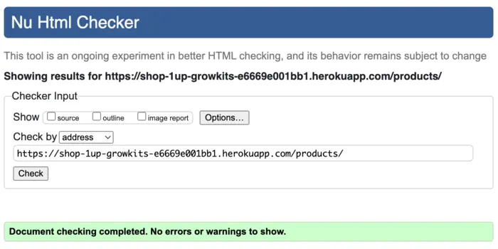

# Testing

Testing file for 1up GrowKits [README.md](README.md).

## Testing User Stories

### Developer Stories

- [x] Frontend and Backend of the project created.
- [x] Database is connected to the project.
- [x] App deployed on Heroku.

### User Stories

- [x] Register an account
- [x] Login & logout of account
- [x] Manage user accounts
- [x] Browse products & courses
- [x] Detailed product & course view
- [] Add featured items
- [x] Add to shopping cart
- [x] Update items in cart
- [x] Secure card payment checkout
- [x] Order summary display
- [x] Order management
- [] Successful order email
- [x] Product & course management
- [] Auto low-stock warning
- [x] Booking a course
- [] Social media profile
- [] Optimize with Google SEO

## Validation

### Validation Errors
- 

### HTML Validation Corrected

- [] HTML validation all passed:

**Home page**  

**Login Page**  

**Logout Page**  

**Review Post Page**  

**About Page**  

### CSS Validation Corrected

- [] CSS validation all passed.

**Home page**  

**Login Page**  

**Signup Page**  

**Logout Page**  

**Review Post Page**  

**About Page**  

### JSHint

- [] JavaScript tests all passed.

### CI Python Linter

- [] Python tests all passed.

    All Python files containing the project's code have been tested. 
    All the errors were fixed, and after running the CI Python Linter, it shows there are no errors.

| **Feature** | **admin.py** | **forms.py** | **models.py** | **urls.py** | **views.py** | **test_views.py** | **test_forms.py** | **tests.py** |
| ----------- |:------------:|:------------:|:-------------:|:-----------:|:------------:|:-----------------:|:-----------------:|:------------:|
| 1up GrowKits main app | n/a | n/a | n/a | [no errors](static/documentation/testing/main-urls.webp) | n/a | n/a | n/a | n/a |
| Products | [no errors](static/documentation/testing/products-admin.webp) | [no errors](static/documentation/testing/products-forms.webp) | [no errors](static/documentation/testing/products-models.webp) | [no errors](static/documentation/testing/products-urls.webp) | [no errors](static/documentation/testing/products-views.webp) | [no errors](static/documentation/testing/products-test-views.webp) | [no errors](static/documentation/testing/products-test-forms.webp) | [no errors](static/documentation/testing/products-tests.webp) |
| Courses  | [no errors](static/documentation/testing/courses-admin.webp) | [no errors](static/documentation/testing/courses-forms.webp) | [no errors](static/documentation/testing/courses-models.webp) | [no errors](static/documentation/testing/courses-urls.webp) | [no errors](static/documentation/testing/courses-views.webp) | [no errors](static/documentation/testing/courses-test-views.webp) | [no errors](static/documentation/testing/courses-test-forms.webp) | [no errors](static/documentation/testing/courses-tests.webp) |

    NOTE: `settings.py` Stock Django code gives E501 error, left unchanged to keep app from breaking.

## Lighthouse Test

- [] Desktop view:

    **Home**  
    

    **Grow Kit page**  
    

    **Grow Guide Page**  
    

    **CoursesPage**  
    

    **Register Page**  
    

    **Login Page**  
    

    **Logout Page**  
    

- [] Mobile view:
    - Performance 

    **Home**  
    

### Accessibility

Accessibility was included in every planning stage for 1up Grow Kits, through the use of the [WAVE report tool](https://wave.webaim.org/) I could ensure that any necessary changes were made to make the website as accessible as it could be.

- 

    

-  [Webaim Contrast Checker](https://webaim.org/resources/contrastchecker/), all errors were resolved successfully.

      

