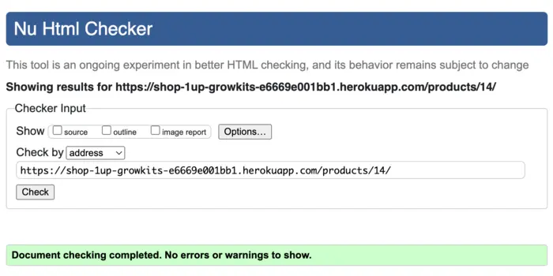
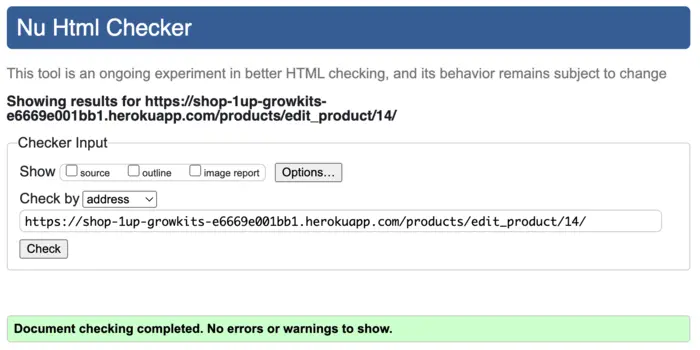
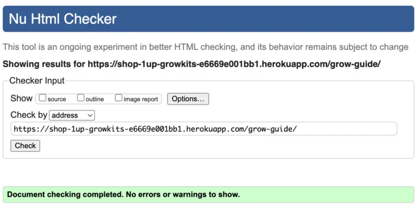
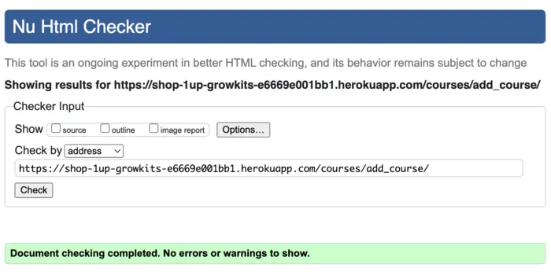
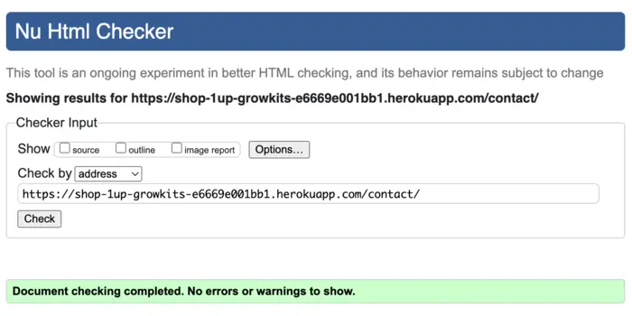
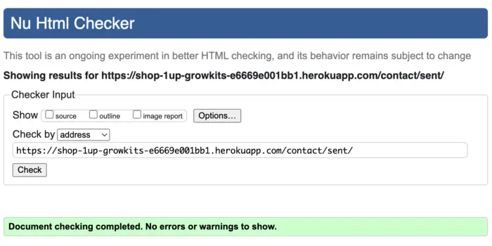

# Testing

Testing file for 1up GrowKits [README.md](README.md).

## Testing User Stories

### Developer Stories

- [x] Frontend and Backend of the project created.
- [x] Database is connected to the project.
- [x] App deployed on Heroku.

### User Stories

- [x] Register an account
- [x] Login & logout of account
- [x] Manage user accounts
- [x] Browse products & courses
- [x] Detailed product & course view
- [x] Add featured items
- [x] Add to shopping cart
- [x] Update items in cart
- [x] Secure card payment checkout
- [x] Order summary display
- [x] Order management
- [x] Successful order email
- [x] Product & course management
- [x] Auto low-stock warning
- [x] Booking a course
- [x] Social media profile
- [x] Optimize with Google SEO

## Validation

### Validation Errors
__HTML__
- Duplicate attribute `rel` on `<link>` tags
- Missing `type="button"` on non-form `<button>`
- Using `
` inside a `<ul>` directly
- Button missing `type="submit"`
- Empty `<a href="">` if no image exists
- `
` inside `<strong>` not valid
- No `alt` fallback if `product.image` missing
- Empty `

`
- Missing closing `
` for the button container
- No `<label>` explicitly for the form fields
- Empty ` ` tag inside `
`
- Misplaced closing `
`
- Trailing slash on void elements
- No `
` element in scope but a `
` end tag
- Stray end tag `
`

### HTML Validation Corrected
Testing using the recommended [HTML W3C Validator](https://validator.w3.org/) to validate all of my HTML files.
- [x] HTML validation all passed:

**Home page**  

**Signup Page**  

**Login Page**  

**Logout Page**  

**Products Page**  

**Product Detail Page**  

**Add Product Page**  

**Edit Product Page**  

**Grow Guide Page**  

**Course Page**  

**Course Detail Page**  

**Add Course Page**  

**Edit Course Page**  

**Contact Page**  

**Message Sent Page**  

**Bag Page**  

**Checkout Page**  

**Checkout Success Page**  

**Profile Page**  

**Order History Page**  

### Validation Errors
__CSS__
- `text-decoration-style: none;` is invalid

### CSS Validation Corrected
Testing using the recommended [CSS Jigsaw Validator](https://jigsaw.w3.org/css-validator/) to validate all of my CSS files.
- [x] CSS validation all passed.

**base.css**  

**profile.css**  

**checkout.css**  

### JSHint

### Validation Errors
__JavaScript__
- `console` undefined. Add `/* global console */`

### JavaScript Validation Corrected
Testing using the recommended [JShint Validator](https://jshint.com/) to validate all of my JavaScript files.
- [x] JavaScript tests all passed.

**bag.js**  

**countryfield.js**  

**admin_message.js**  

**stripe_element.js**  

### CI Python Linter

- [] Python tests all passed.

    All Python files containing the project's code have been tested. 
    All the errors were fixed, and after running the CI Python Linter, it shows there are no errors.

| **Feature** | **admin.py** | **apps.py** | **models.py** | **urls.py** | **views.py** | **forms.py** | **tests.py** | 
| ----------- |:------------:|:-----------:|:-------------:|:-----------:|:------------:|:------------:|:------------:|
| 1up GrowKits main app | n/a | n/a | n/a | [no errors](static/documentation/testing/main-urls.webp) | n/a | n/a | n/a |
| home | [no errors](static/documentation/testing/home-admin.webp) | [no errors](static/documentation/testing/home-apps.webp) |  [no errors](static/documentation/testing/home-models.webp) | [no errors](static/documentation/testing/home-urls.webp) | [no errors](static/documentation/testing/bag-views.webp) | n/a | [no errors](static/documentation/testing/home-tests.webp) |
| products | [no errors](static/documentation/testing/products-admin.webp) | [no errors](static/documentation/testing/products-apps.webp) | [no errors](static/documentation/testing/products-models.webp) | [no errors](static/documentation/testing/products-urls.webp) | [no errors](static/documentation/testing/products-views.webp) | n/a | [no errors](static/documentation/testing/products-tests.webp) |
| guide | [no errors](static/documentation/testing/guide-admin.webp) | [no errors](static/documentation/testing/guide-apps.webp) | [no errors](static/documentation/testing/guide-models.webp) | [no errors](static/documentation/testing/guide-urls.webp) | [no errors](static/documentation/testing/guide-views.webp) | n/a | [no errors](static/documentation/testing/guide-tests.webp) |
| courses | [no errors](static/documentation/testing/courses-admin.webp) | [no errors](static/documentation/testing/courses-apps.webp) | [no errors](static/documentation/testing/courses-models.webp) | [no errors](static/documentation/testing/courses-urls.webp) | [no errors](static/documentation/testing/courses-views.webp) | n/a | [no errors](static/documentation/testing/courses-tests.webp) |
| bag | [no errors](static/documentation/testing/bag-admin.webp) | [no errors](static/documentation/testing/bag-apps.webp) | [no errors](static/documentation/testing/bag-models.webp) | [no errors](static/documentation/testing/bag-urls.webp) | [no errors](static/documentation/testing/bag-views.webp) | n/a | [no errors](static/documentation/testing/bag-tests.webp) |
| checkout | [no errors](static/documentation/testing/checkout-admin.webp) | [no errors](static/documentation/testing/checkout-apps.webp) | [no errors](static/documentation/testing/checkout-forms.webp) | [no errors](static/documentation/testing/checkout-models.webp) | [no errors](static/documentation/testing/checkout-urls.webp) | [no errors](static/documentation/testing/checkout-views.webp) | [no errors](static/documentation/testing/checkout-tests.webp) |
| profiles | [no errors](static/documentation/testing/profiles-admin.webp) | [no errors](static/documentation/testing/profiles-apps.webp) | [no errors](static/documentation/testing/profiles-models.webp) | [no errors](static/documentation/testing/profiles-urls.webp) | [no errors](static/documentation/testing/profiles-views.webp) | n/a | [no errors](static/documentation/testing/profiles-tests.webp) |

| **Feature** | **contexts.py** | **signals.py** | **webhook_handler.py** | **webhooks.py** |
|-------------|:---------------:|:--------------:|:----------------------:|:---------------:|
| bag | [no errors](static/documentation/testing/bag-contexts.webp) | n/a | n/a | n/a |
| checkout | n/a | [no errors](static/documentation/testing/checkout-signals.webp) | [no errors](static/documentation/testing/checkout-webhook-handler.webp) | [no errors](static/documentation/testing/checkout-webhooks.webp)

    NOTE: `settings.py` Stock Django code gives E501 error, left unchanged to keep app from breaking.

## Lighthouse Test

- [] Desktop view:

    **Home**  
    

    **Grow Kit page**  
    

    **Grow Guide Page**  
    

    **CoursesPage**  
    

    **Register Page**  
    

    **Login Page**  
    

    **Logout Page**  
    

- [] Mobile view:
    - Performance 

    **Home**  
    

### Accessibility

Accessibility was included in every planning stage for 1up Grow Kits, through the use of the [WAVE report tool](https://wave.webaim.org/) I could ensure that any necessary changes were made to make the website as accessible as it could be.

- 

    

-  [Webaim Contrast Checker](https://webaim.org/resources/contrastchecker/), all errors were resolved successfully.

      

## Manual Testing

### User Input / Form Validation

Testing was carried out on desktop using a Chrome browser to ensure all forms take the intended input and process the input appropriately. Manual testing by checking the following:

| **TEST INPUT**| **CORRECT OUTCOME** | **MEET REQUIREMENTS** |
| ------------- |:-------------------:|-----------------------|
**Navbar Logo and Icons** | PASS | Logo takes user to home page, nav bar links (Home, Grow Kits, Grow Guide, Courses) work, hover effect present. Mobile menu opens/closes and links work.
**Login Link** | PASS | Clicking 'Login' in nav opens the Login page correctly.
**Log into Account** | PASS | Username and password fields present. Empty fields trigger validation. Correct login shows confirmation pop-up below navbar.
**Register Link** | PASS | Clicking 'Register' opens the Register page correctly.
**Register Account** | PASS | Username, email (optional), and password fields. Validation for empty fields, invalid email format, password length, etc. Successful registration shows confirmation.
**Home Page Shop Now** | PASS | 'Shop Now' button directs user to the Products page successfully.
**Mushroom Kits Page Link** | PASS | Grow Kits page loads correctly with product listings.
**Grow Guide Page Link** | PASS | Grow Guide page loads properly with educational content.
**Courses Page Link** | PASS | Courses page loads properly with course offerings.
**Logout** | PASS | Clicking 'Logout' redirects to logout confirmation page and displays logout success message under navbar.
**Social Links** | PASS | Footer social links open in new tabs and direct to correct sites.
**Add Product to Bag** | PASS | Product detail page allows quantity selection and 'Add to Bag' updates bag correctly with success message.
**Add Course to Bag** | PASS | Course detail page allows quantity (spots) selection and 'Add to Bag' updates bag correctly with success message.
**View Bag Page** | PASS | Clicking Bag icon or 'View Bag' link opens bag page showing all items, images, quantities, subtotals, and totals accurately.
**Update Quantity in Bag** | PASS | Quantity field can be updated directly and recalculates totals live.
**Remove Item from Bag** | PASS | Clicking remove (trash) icon deletes item from bag and updates totals with success message.
**Proceed to Checkout** | PASS | Bag 'Secure Checkout' button directs correctly to checkout page with bag summary displayed.
**Checkout Form Validation** | PASS | Empty required fields show validation errors. Email must be valid format. Fields like name, address, and postcode are required before submission.
**Payment Card Input** | PASS | Stripe card input fields load correctly (card number, expiry, CVC). Only valid card formats allowed.
**Place Order with Valid Card** | PASS | Entering valid test card (e.g., Stripe test card 4242 4242 4242 4242) and correct billing info allows checkout to complete, shows success page, and sends confirmation email.
**Place Order with Invalid Card** | PASS | Using invalid test card numbers causes Stripe to reject payment and show error without submitting form.
**Order Confirmation Page** | PASS | After successful checkout, order confirmation page displays order number, email, and bag summary clearly.
**Order History in Profile** | PASS | Logged-in users can view past orders correctly via profile page 'Order History', showing order number, date, items, and total.
**Checkout Save Info Toggle** | PASS | Toggling "Save this delivery information to your profile" saves user delivery info for future purchases (if logged in).
**Save Cart on Logout and Restore on Login** | PASS | Bag contents are saved automatically to the user's profile if they logout with items still in bag. After re-logging in, the saved bag is restored exactly as left (products, courses, quantities all correct).
**Courses Don't Charge Delivery (Standalone / Mixed Cart)** | PASS | Courses added alone in bag = no delivery fee charged. Courses added with products = only the product(s) calculate delivery fee; courses still do not add delivery cost.
**Contact Form Submission** | PASS | Contact form validates required fields (name, email, message). Empty fields cause validation errors. Successful submission shows confirmation message.
**Footer Subscribe Form** | PASS | Footer email subscription form validates email format. Empty or invalid email triggers error. Successful valid email submission shows confirmation.
**Stock/Course Adjustment After Checkout** | PASS | After successful checkout, purchased products & courses have their stock & spots available correctly reduced by the purchased amount. No over-selling possible.
**Enrollment Creation for Courses** | PASS | After successful checkout, user is automatically enrolled into purchased course(s) with correct number of spots. Enrollment records appear in database.

## Bugs Encountered 
  
The below are bugs that I spent more time investigating, most of these encountered were learning curves. 

| **No.** | **Bug** | **Solved** | **Fix** | **Solution Credit** | **Commit No.** |
| ------- | ------- |:----------:| ------- | ------------------- |:--------------:|
| **1.** | Courses not displaying in bag view | YES | Fix bag logic to handle both Product & Course items. Modified bag_contents to distinguish between items. | [Django Docs](https://docs.djangoproject.com/en/5.2/topics/http/shortcuts/#get-object-or-404/) | 93a69e0 |
| **2.** | Admin OrderLineItem user error | YES | Prevent deleting of line items from the order admin panel, by hiding extra item panels until needed. | [Django Docs](https://docs.djangoproject.com/en/5.1/ref/contrib/admin/) | 44e8f9f |
| **3.**| Delete message prompt in OrderAdmin | YES | Re-activating delete function to modify orders, but prevent deleting accidentally by adding a delete message prompt to admin. Deletion of order items to be confirmed before action proceeds when saved. | [Stack Overflow](https://stackoverflow.com/questions/4661074/delete-confirmation/) | a0bd3de |
| **4.** | Admin OrderLineItem confusing UI logic | YES | Modify product & course fields from side-by-side layout, to a single dropdown field labeled “Item” | [Stack Overflow](https://stackoverflow.com/questions/18265023/self-instance-in-django-modelform/) | e5cb149 |
| **5.** | Course charging delivery cost | YES | The bag was calculating delivery based on the entire total, which included courses. Modifying delivery logic to be consistent between checkout display & order save logic allows the courses to not factor a delivery cost and still allows physical products within mixed orders calculate delivery as expected. | [Stack Overflow](https://stackoverflow.com/questions/46007047/how-do-you-handle-shipping-rates-when-cart-has-both-physical-and-digital-items) | 808b273 |

### Unfixed Bugs

- 

    
